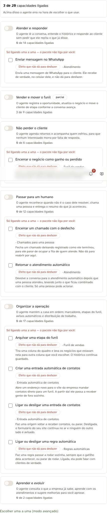
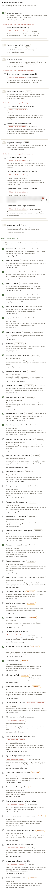
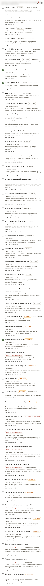
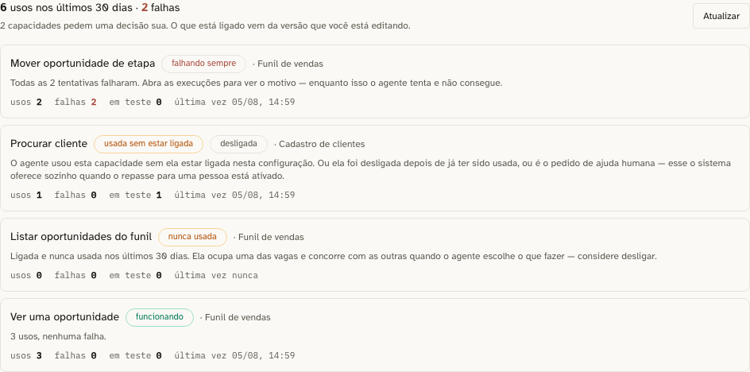

# HANDOFF — IA 360

> Documento **vivo**. Alimentado a cada progresso, cada bug encontrado e cada bug corrigido.
> Toda afirmação declara o **SHA curto** de onde foi medida. Número sem SHA não compara.
>
> Contrato e motivos: `docs/handoffs/BRIEFING-ia-360.md` — leia antes de tocar em código.
> Branch: `feat/ia-360-mcp` · Base: `origin/main` = `687716a`
> Worktree do Maestro: `/Users/rafaelmelgaco/DeskcommCRM-ia360`

---

## Linha de base medida (SHA `687716a`, árvore limpa)

| Medida | Valor |
|---|---|
| Tools no catálogo MCP | 16 (9 leitura, 6 escrita, 1 handoff) |
| Tabelas no `baseline.sql` (dump + apêndice) | ~100 |
| Tabelas alcançáveis pelas 16 tools | ~8 |
| Tools de follow-up (anti-morte, invariante 4) | **0** |
| Operações de arquivamento/encerramento expostas à IA | **0** |
| Tools nativas do engine fora do catálogo e invisíveis na tela | 7 |
| Teto de tools por agente | 20 (`lib/ai/agents/validation.ts`) |
| `pnpm typecheck` | limpo |
| `pnpm lint` | 0 erros / 170 avisos (pré-existentes) |

**As 7 tools sombra** (existem em `lib/agent-engine/agent/inbound-turn.ts`, o humano não vê nem
configura): `get_lead_context`, `search_knowledge`, `send_message`, `update_lead_state`,
`save_lead_note`, `get_lead_note`, `request_human_handoff`.

**Achado arquitetural que barateia tudo:** `lib/mcp/tools/catalog.ts` é **fonte única** para três
consumidores — o MCP externo (`/api/mcp`), o runtime nativo da tela (`lib/ai/runtime/tools.ts`) e o
harness de vendas (`lib/agent-engine/edge/crm/mcp-tools.ts`). Uma capacidade nova entra em **um**
lugar e serve os três.

**Achado que muda a estratégia:** existem ~140 rotas em `app/api/v1/` que já contêm a regra de
negócio. A tool é fachada fina sobre elas (Decisão 4 do briefing), nunca reimplementação.

---

## Progresso

### Wave 0 — contrato do catálogo · CONCLUÍDA

**Entregue por:** Maestro (terminal "Assistente e Testes")

O que mudou:

- `lib/mcp/tools/pacotes.ts` (novo) — camada de apresentação client-safe: os 6 pacotes por
  jornada (`atender`, `vender`, `reter`, `escalar`, `organizar`, `evoluir`), os 3 níveis de risco
  (`seguro`, `atencao`, `critico`) e a regra `entraPorPacote()` — capacidade `critico` nunca é
  ligada por pacote, exige marcação explícita do humano.
- `lib/mcp/tools/catalog.ts` — `McpToolCatalogEntry` ganhou `rotulo`, `explicacao`, `oQueToca`,
  `risco`, `pacotes`. As 16 tools existentes preenchidas em pt-BR. Nenhum `name` renomeado
  (Decisão 3 — contrato de wire preservado).
- `tests/unit/catalogo-tools-leigo-friendly.test.ts` (novo) — o gate mecânico do pilar 3.

**Evidência observada:**

```
pnpm vitest run tests/unit/catalogo-tools-leigo-friendly.test.ts
 Test Files  1 passed (1)
      Tests  53 passed (53)

pnpm typecheck  → limpo
pnpm lint       → 0 errors, 170 warnings (todos pré-existentes na main)
```

**Sabotagem (verde de primeira não prova nada).** Apliquei três defeitos de propósito e confirmei
que cada um reprova no teste certo:

| Sabotagem | Teste que reprovou |
|---|---|
| `rotulo: "crm_search_contacts"` (identificador técnico vazado) | `crm_search_contacts tem rotulo em portugues de gente` |
| `explicacao: "Abre o lead."` (curta + jargão) | `crm_get_lead explica o efeito, nao o codigo` |
| tool de leitura anunciada como `risco: "critico"` | `o risco anunciado ao humano bate com a categoria tecnica` |

Resultado: `Tests 3 failed | 50 passed (53)`. Revertido em seguida; verde restaurado.

**Dívida declarada no próprio teste:** os pacotes `reter` (Não perder o cliente) e `evoluir`
(Aprender e evoluir) nascem **vazios** — não existe nenhuma capacidade de follow-up nem de
conhecimento no catálogo. É exatamente o buraco que este épico existe para fechar, e é a violação
mais grave da linha de base: o invariante 4 da doutrina ("nada morre sem próximo passo") não tem
como ser cumprido por um agente que não consegue agendar um retorno.

O teste lista essa dívida explicitamente e tem uma **segunda guarda** que reprova se a lista
envelhecer — se a wave entregar as tools e ninguém tirar o pacote da dívida, o teste acusa.

### Wave 4 — Organizar a operação · EM ANDAMENTO

**Terminal:** MaestroConexoes · worktree `/Users/rafaelmelgaco/DeskcommCRM-ia360-w4-organizar`
· branch `feat/ia-360-w4-organizar` · base `99cd0fc` (contém `origin/main` = `687716a`;
`git log HEAD..origin/main` vazio, medido antes de começar).
### Wave 1 — o painel do humano · CONCLUÍDA

**Entregue por:** Arquiteto (worktree `DeskcommCRM-ia360-w1-painel`, branch `feat/ia-360-w1-painel`)
**Commits:** `ddb53bd` (rota) · `259567e` (tela) · `032f038` (observabilidade) · `41e61b2` (prova em tela + mapa vivo)

#### O que mudou

**1. A rota serve a camada do humano** (`ddb53bd`)
`app/api/v1/mcp/tools/route.ts` montava a resposta só a partir dos handlers, que carregam a metade
do MODELO. Agora `lib/mcp/tools/catalogo-servido.ts` junta as duas metades por `name` e **recusa
servir handler sem entrada no catálogo** — servir com rótulo vazio empurra o defeito para a tela do
dono da clínica, onde ele aparece como um id monoespaçado dentro de um card. Campos novos no wire:
`rotulo`, `explicacao`, `o_que_toca`, `risco`, `pacotes`.

**Para as outras waves:** o teste `tests/unit/catalogo-servido.test.ts` prende a bijeção nos DOIS
sentidos. Entrada no catálogo sem handler faz o `tool_ids` aceitar o id, o agente ser publicado e o
runtime descartar a capacidade em silêncio (`pickToolsFromMcp` faz `if (!def) continue`) — o humano
vê ligado na tela algo que nunca chega ao modelo. Se você adicionar entrada, adicione o handler.

**2. A tela por jornada** (`259567e`)
`ToolPicker.tsx` reconstruído. Caminho padrão = os 6 pacotes; modo avançado = checkbox por
capacidade com a ficha (rótulo, explicação, o que toca, risco) e o `name` técnico só ali.

A regra **não** mora no componente: `lib/mcp/tools/selecao-por-pacote.ts` é função pura sobre listas
de nome. O que ela prende, além de `entraPorPacote`:
- desligar um pacote leva junto a capacidade `critico` **dele** — declarar que a jornada acabou e
  ficar com o direito de enviar WhatsApp é a pior surpresa possível (falha fechado);
- o que pertence a outro pacote ainda ligado sobrevive, senão desligar um esvaziaria o vizinho;
- pacote só com capacidade crítica nunca aparece "ligado".

O teto de 20 saiu de número mágico em três lugares para `TETO_TOOLS_POR_AGENTE`, que
`lib/ai/agents/validation.ts` importa: o teto que a tela mostra é o que o servidor recusa.

**3. O uso das capacidades, que era log morto** (`032f038`)
`api_audit_log` registrava `mcp.tool_called` desde a Spec 11 e **nenhuma tela lia**. Nova aba
**Capacidades** na página do agente: por capacidade, usos, falhas, quantos vieram de teste, última
vez — e a recomendação do que fazer (invariante 5). `fn_agent_tool_usage` (migration **0103** +
apêndice no baseline + MANIFEST) faz a agregação no banco; o elo é
`api_audit_log.request_id = ai_agent_runs.id`.

Medido em pg17 com 708.020 linhas de audit (10,2% tool calls) e 36.000 runs, melhor de 3:
**345,7 ms** sem janela no lado do audit · **224,0 ms** com a janela nos dois lados · **165,0 ms**
com um índice parcial dedicado — o índice **não** foi adotado (audit é append-only de escrita
altíssima; 60 ms numa aba não pagam manutenção em todo INSERT). A medição está na migration como
linha de base.

#### Evidência observada (SHA `032f038` + prova em tela no working tree)

```
pnpm typecheck                     → limpo
pnpm lint                          → 0 erros, 170 avisos (a MESMA linha de base da Wave 0;
                                     nenhum aviso em arquivo desta wave)
pnpm vitest (4 arquivos da wave)   → 44 passed
pnpm test:unit (suíte inteira)     → 1986 passed | 1 failed (1987) — ver nota abaixo
pnpm test:db                       → 419 passed | 1 skipped (63 arquivos)
                                     install (ON_ERROR_STOP=1) + update do baseline verdes
E2E em tela (Playwright, chromium) → 5 passed (45,2s)
```

**Sobre o 1 vermelho do `test:unit`, sem arredondar para verde.** Em três rodadas
da suíte inteira nesta máquina, falharam **arquivos diferentes a cada vez**
(`lib/ui/icons`, `TeamMembersClient`, `_mapping`, `composer-emoji`) — todos testes
de componente estourando tempo (43s, 17s, 15s, 4,5s) enquanto build, docker e E2E
disputavam a máquina. Cada um **passa isolado** (medido: os três primeiros juntos,
23 passed em 15,7s; `composer-emoji`, 1 passed em 5,9s). E nenhum deles referencia
qualquer arquivo desta wave — `grep` por `selecao-por-pacote|catalogo-servido|
uso-de-capacidades|UsoDasCapacidades|ToolPicker|AgentTabs|AgentForm|mcp/tools`
nos quatro: nenhuma ocorrência. Os 4 arquivos de teste da wave passaram em todas
as rodadas. **Não afirmo suíte 100% verde nesta máquina**; afirmo que o vermelho
é de carga e não desta wave, e que o CI (máquina dedicada) é quem dá a palavra.

Evidência visual versionada em `evidence/ia-360-w1/`:





#### Sabotagem (verde de primeira não prova nada)

| Sabotagem | O que reprovou |
|---|---|
| `entraPorPacote` → sempre `true` (unit) | 6 de 19, incl. "ligar Atender não dá direito de enviar WhatsApp" |
| `desligarPacote` não leva a crítica | 1 de 19 |
| `estadoDoPacote` contando a crítica | 2 de 19 |
| junção servindo ficha vazia em vez de lançar | 1 de 7 |
| entrada removida do catálogo | arquivo inteiro reprova no import |
| precedência dos sinais invertida | os 2 casos de precedência |
| `fn_agent_tool_usage` sem filtro de agente (Postgres real) | 6 de 6 |
| idem, sem filtro de `action` | 4 de 6 |
| idem, `em_teste` fixo em 0 | 1 de 6 |
| **`entraPorPacote` → `true` + rebuild + E2E NA TELA** | **o caso do WhatsApp reprovou na tela** |

A última é a que importa: unitário prova a função, só a tela prova que a função é a que o clique
chama.

#### Achados (dois defeitos meus, pegos pela prova em tela)

1. **A recomendação afirmava uma causa que nem sempre é a certa.** "Usada sem estar ligada" dizia
   "é o caso do pedido de ajuda humana" — verdade para o handoff auto-injetado, mentira para uma
   capacidade que foi **desligada depois** de já ter sido usada. Corrigido para nomear as duas
   hipóteses. Só apareceu porque o E2E rodou contra um cenário onde a segunda hipótese existia.
2. **Um teste meu passou por sorte.** O caso de persistência lia o estado inicial do DOM antes de a
   configuração carregar, comparava `[]` com `[]` e passava — e ainda deixava o cenário do próximo
   caso diferente. Agora espera o consumo do teto estabilizar e devolve o cenário pelo seed.

#### Passada de QUALIDADE (não de funcionamento) — e o que ela achou

O E2E respondia "funciona?". Faltava "ficou bom?". `tests/sonda-qualidade-capacidades.ts`
mede o que teste verde não vê: sobreposição real (`elementFromPoint`), contraste
(WCAG AA), largura, teclado, tema escuro e estado de erro. Rodada final: **0 defeitos,
7 OK, 3 não-conclusivos declarados**.

**A sonda mentiu três vezes antes de acertar, e isso é o registro mais útil daqui:**

| o que ela disse | por que era falso | o que consertou |
|---|---|---|
| "algo cobre o card" (3 pontos) | `elementFromPoint` fora da viewport devolve `null`, e eu lia `null` como "coberto" | rolar até o elemento + só medir ponto dentro do quadro |
| "não mostra recado no erro" | `isVisible()` **não espera** — o `timeout` dele não faz o locator aguardar | `waitFor({state:"visible"})`; a tela mostra o recado em **96 ms** (500) e **901 ms** (rede caída, 3 tentativas) |
| "contraste OK" com **2** amostras | aprovação por amostra vazia | seletor mais largo + guarda que reprova amostra < 10; agora **14 medidas**, nenhuma < 4,5:1 |

**Um defeito REAL, meu, e o conserto:** a fila de abas do detalhe do agente passou de
5 para 6 (eu adicionei "Capacidades") e, em 390px, media **814px** — a página inteira
rolava na horizontal. Isolei ancestral por ancestral: quem decidia era o container de
conteúdo do `AppShell`, com o `min-width: auto` que todo flex item tem. Duas linhas:
`min-w-0` no `AppShell` e `max-w-full overflow-x-auto` na `TabsList`.

Medido depois, em várias larguras (estouro horizontal da página):

| largura | antes | depois | abas |
|---|---|---|---|
| 1440 / 1280 / 1024 / 900 | 0 | 0 | cabem |
| 768 | 0 | **0** | rolam dentro da própria caixa |
| 600 | — | 2 | rolam |
| 390 | **476** | **212** | rolam |

Os 212px que sobram em 390px **não são desta tela**: a lista de agentes, que não é
minha, estoura os mesmos 212px. É o piso do app.

O conserto foi no `components/ui/tabs.tsx` e no `AppShell`, não na minha tela, de
propósito: **toda** `TabsList` do app tinha a mesma fragilidade, e consertar só onde
eu esbarrei deixaria as irmãs quebradas com um álibi de "já foi tratado".

**Achado que NÃO é meu e eu não consertei** (`evidence/ia-360-w1/w1-achado-390px-sidebar-fixo.png`):
em 390px o app é inutilizável — o sidebar é fixo em **240px** e não colapsa, sobrando
~150px de conteúdo, com campos de formulário de uma letra por linha. Vale para toda
tela do produto, não só esta. Ponto de quebra medido: **768px é o menor tamanho usável**
(estouro 0). Isto é decisão de produto (o DeskcommCRM é ferramenta de operação em
desktop?) e mexe no shell de todos — **item para o Maestro**, não conserto de wave.

Regressão dos dois fixes: `capacidades-do-agente` + `navegacao` = **14 passed** (o
segundo é justamente quem mede sidebar, dobra e rolagem do menu).

#### Telas descobertas + prova com IA REAL (pedido do Maestro)

Duas telas do épico não tinham spec nenhum: `ai/agents/new` e `ai/usage`. Agora têm
(`tests/e2e/agente-novo-e-uso.spec.ts`, **5 passed**), e o agente é criado **pelo
formulário**, não por seed — a diferença entre provar que a tela funciona com dado
plantado e provar que alguém chega lá sozinho.

**O ciclo inteiro com IA de verdade.** Com a chave real do Rafael, cadastrada **pela
tela** de credenciais, agente criado **pela tela** com `openai / gpt-5.6-terra`:

```
turno real: status completed · 6.760 ms · 9.652 tokens in / 210 out · 3 cents
a IA escolheu sozinha:  crm_list_pipelines  (16:24:46)
                        crm_list_leads      (16:24:48)
o painel da W1 mostrou as duas, marcadas "só em teste" (o run era dry-run)
```

Isto é o fecho da alça que a wave existe para fazer: **configurei pela tela → a IA
real decidiu usar → eu vejo o que ela usou**. Evidência: `evidence/ia-360-w1/w1-ia-real-uso-no-painel.png`.

**Um defeito MEU que só a IA real revelou.** Dois minutos depois de criar o agente, o
painel dizia *"7 capacidades pedem uma decisão sua"* e recomendava **desligar** o que o
dono tinha acabado de ligar — porque "nunca usada nos últimos 30 dias" tratava
configuração nova e configuração abandonada como a mesma coisa. A frase estava certa
sobre o dado e errada sobre o mundo. Corrigido com o sinal `recem_ligada`, que compara a
idade da configuração com a janela; a rota passa `created_at` da versão. Depois do
conserto, na mesma tela: **"1 capacidade pede uma decisão sua"** — a única que de fato
falhou. Testado com relógio injetado (`agora`), não com o da máquina.

**Achado para quem cuida do funil:** no mesmo turno real, `crm_create_stage` ("Criar
etapa no funil") aparece como *falhando sempre* — 1 tentativa, 1 falha. A IA tentou e não
conseguiu. Não investiguei: não é da W1, e o painel agora torna isso visível, que era o
objetivo.

**Achado de linguagem, e ele contradiz o pilar 3 do épico.** A tela de criar agente é
**bilíngue**: o bloco de capacidades fala com o dono da clínica, e o resto da mesma tela
fala com engenheiro — *"Max steps"*, *"Token budget"*, *"Custo máx (cents)"*, *"Provider"*,
*"System prompt"*, *"Histórico (msgs)"*, *"Concorrência: 1 por conversa"*, *"Filtro por
regex"* com exemplo `(?i)\b(pedido|status)\b`, *"Maior prioridade = avaliado primeiro
pelo dispatcher"*, *"Permitir handoff via tool"*, e o título *"Novo agent"*. O pilar 3
foi aplicado num bloco e não na tela. Não corrigi: é escopo de produto e toca campos de
outras waves — **item para o Maestro**, com a captura `evidence/ia-360-w1/w1-nova-01-tela-de-criar.png`.

**O que este spec NÃO alcança, declarado:** o estado "instalei agora e não tenho
credencial nem número". A primeira versão tentou montá-lo interceptando as listagens no
navegador e **passou sem medir nada** — a página é Server Component, as consultas
acontecem no servidor. Montar de verdade exige organização zerada, que este banco não
tem. O que ficou no lugar é o que dá para cobrar sempre: a tela exige credencial e
número, então tem de oferecer link para conseguir os dois — e oferece.

**Custo de processo que atrapalhou (para o épico, não para mim):** o TOTP do admin foi
rotacionado por outra frente **três vezes** durante esta sessão, cada uma derrubando uma
bateria inteira com "MFA falhou" — sintoma que não parece o que é. Some com isso um
segundo tropeço próprio: logins em sequência reusavam o **mesmo código** dentro da janela
de 30 s e o servidor recusa repetição (proteção de replay). O helper deste spec agora
nunca reenvia o código da janela anterior.

#### A tela bilíngue, resolvida (pedido do Rafael)

O achado anterior era que o pilar 3 tinha sido aplicado **num bloco** e não na tela.
Agora foi aplicado na tela inteira, em três telas:

| onde | antes | agora |
|---|---|---|
| criar agente | "Identificação" · "Modelo & credencial" · "Provider" · "Sessão" | "Quem é este agente" · "A inteligência que ele usa" · "Empresa de inteligência artificial" · "Número conectado" |
| limites | "Max steps" · "Token budget" · "Custo máx (cents)" · "Histórico (msgs)" | "Freios de segurança": "Ações por atendimento" · "Volume de texto por atendimento" · "Custo máximo por atendimento (centavos)" · "Mensagens anteriores que ele lê" |
| prioridade | "Maior prioridade = avaliado primeiro pelo dispatcher" | "Quando mais de um agente puder atender a mesma conversa, o de número maior tenta primeiro. Se você só tem um agente, pode deixar como está." |
| gatilhos | "Eventos" · `message` · "Filtro por regex" com `(?i)\b(pedido\|status)\b` · "Concorrência: 1 por conversa" | "Quando ele entra em ação" · "Uma mensagem nova do cliente" · "Só responder quando a mensagem falar de algo específico" com `pedido\|status\|orçamento` · "Um de cada vez por conversa" |
| handoff | "Handoff humano" · "Permitir handoff via tool (decisão do agent)" | "Passar para uma pessoa" · "Deixar o agente chamar uma pessoa quando perceber que não é caso dele" |
| uso de IA | "Invocações" · "Handoff rate" · "p95 latência 17.621 ms" · "Tokens / dia" | "Atendimentos com IA" · "Passaram para uma pessoa" · "Tempo de resposta 16,2 s" · "Volume de texto processado por dia" |
| chaves | "Chaves BYO (Bring-Your-Own) por provider. Cifradas em repouso (AES-GCM)" | "A conta de inteligência artificial é sua: você contrata direto na Anthropic, OpenAI ou Google e cola a chave aqui." |

**Duas mudanças que não são tradução, são conserto:**

1. **As validações deixaram de acusar.** O formulário recém-aberto exibia "Nome
   obrigatório." em vermelho antes de a pessoa digitar qualquer coisa. Agora são
   instruções — "Dê um nome para este agente" —, mesmo comportamento, outro tom.
2. **O orçamento parou de prometer proteção que não existe.** Sem limite definido, a
   tela dizia "R$ 0,00 de —" e, ao lado, "pausa ao 100%" — 100% de um teto inexistente.
   Agora: "Sem limite definido — a IA não vai parar sozinha por gasto."

**Um defeito que eu mesmo criei e peguei antes de commitar:** troquei o título do
gráfico para "Tempo de resposta por dia (segundos)" e o eixo continuava em
milissegundos (24.000 na lateral). Título e régua discordando é pior que os dois em
jargão. Corrigido no eixo e no tooltip.

**Resíduo declarado:** o contador do campo de instruções ainda diz "~21 tokens".
`lib/ui/TokenCounter.tsx` é compartilhado com outras telas fora do escopo desta wave,
e "token" não tem tradução consagrada — trocar ali mexe em tela que não é minha.

Varredura final de jargão no texto visível (`TreeWalker` sobre nós de texto, pulando
`script`/`style` e elementos sem caixa) em `ai/agents/new`, `ai/usage` e
`ai/credentials`: **limpo** nas três. O único casamento restante é o nome de uma
credencial criada pelo seed de teste — dado, não interface.

Prova: `evidence/ia-360-w1/w1-pt-01-criar-agente.png`, `evidence/ia-360-w1/w1-pt-02-uso-de-ia.png`, `evidence/ia-360-w1/w1-pt-03-chaves.png`.
`pnpm typecheck` limpo · `pnpm lint` 0 erros · E2E das duas telas **10 passed**.

**E o login de E2E agora se recupera sozinho** (`tests/e2e/helpers/login-admin.ts`):
quando outra frente rotaciona o fator TOTP deste banco compartilhado, ele re-semeia
uma vez e segue, em vez de derrubar a bateria com "MFA falhou". O orçamento de tempo
dos describes subiu para 240 s para caber essa recuperação.

#### Coisas que a W1 NÃO conseguiu provar (declarado de propósito)

- **A recusa do teto de 20 não é alcançável pela tela hoje.** O catálogo tem 16 capacidades e
  ligar tudo dá menos que 20 — o caminho de recusa existe, tem teste unitário, e só vira alcançável
  quando W2/W3/W4 entregarem. O que a tela prova hoje é o **consumo** ("11 de 20").
- **`lib/database.types.ts` não foi regenerado** para incluir `fn_agent_tool_usage` (exigiria
  conexão ao projeto Supabase remoto). A rota usa o admin client, que não é tipado — não há erro de
  tipo hoje, mas quem regenerar os types deve incluí-la.

#### Duas coisas que atrapalham quem for rodar E2E depois

- **Configurar exige `admin`, não `manager`.** `page.tsx` passa `readOnly` quando `role < admin`, e
  o formulário inteiro nasce desabilitado (o switch resolve para `<button disabled>`). É RBAC
  pré-existente; o spec loga como admin com TOTP. A aba **Capacidades** (observabilidade) é de
  `manager`, e a rota foi escrita com essa régua de propósito.
- **As quatro waves compartilham o mesmo Supabase local.** `seed-e2e-credentials.ts` **rotaciona o
  factor TOTP do admin** e reescreve `.e2e-creds.json`. Quando outra wave roda esse seed, o segredo
  da sua sessão fica inválido e o login de admin falha com "MFA falhou em 2 tentativas" — sintoma
  que não parece o que é. Rode o seed imediatamente antes do E2E.
- **`update` do baseline emite `ERROR: relation "idx_crm_leads_org_expected_close_overdue" already
  exists`** (pré-existente, não desta wave). O sintoma vale: quem atualiza um clone vê vermelho no
  terminal e se assusta.

  **Correção de atribuição (era minha, e estava errada).** Eu escrevi que era um `create index` sem
  guarda **no apêndice**, e propus um forward-fix de uma linha. O `@Assistente e Testes` mediu e
  apontou o dump; remedi em `43639f5`, árvore limpa: o índice está na **linha 2410** e o apêndice só
  começa na **3987** — ele é do **dump do `pg_dump`**, não do apêndice. Contagem por parte:

  | parte do baseline | índices | com `if not exists` | tabelas | com `if not exists` |
  |---|---|---|---|---|
  | dump (1–3986) | 112 | **0** | 38 | 38 |
  | apêndice (3987–8844) | 74 | 74 | 60 | 60 |

  Ou seja: **um `if not exists` numa linha faria sumir o erro daquela linha e deixaria 111 iguais** —
  o forward-fix que propus era o conserto por instância de um problema que é de classe. É também por
  isso que o `update.sh` roda sem `ON_ERROR_STOP`: com um dump sem guardas, re-aplicar em banco
  existente **tem** que tolerar erro. Isso é desenho, não descuido.

  Um refinamento sobre o dump, para quem for medir: não é que "nenhum `create` do dump tenha guarda"
  — as **38 tabelas têm** `CREATE TABLE IF NOT EXISTS`. Quem não tem são os **112 índices**. Importa
  na hora de conferir a contagem de `ERROR` do `update`: o piso vem dos índices, não das tabelas.

  Consertar de verdade é mudar como o kit gera ou consome o baseline — maior que uma linha e maior
  que este épico. O `@Assistente e Testes` está medindo quantos `ERROR` o `update` emite de fato e
  abre item próprio. **Ninguém mexe nisso dentro do IA 360.**
### Wave 2 — Não perder o cliente (pacote `reter`) · CONCLUÍDA

**Entregue por:** DevVivo · branch `feat/ia-360-w2-reter` · worktree
`/Users/rafaelmelgaco/DeskcommCRM-ia360-w2-reter` · base `99cd0fc`

| Medida | Antes (`99cd0fc`) | Depois (`02904498`) |
|---|---|---|
| Capacidades de retorno no catálogo | **0** | **6** |
| Pacote `reter` | vazio (dívida declarada) | preenchido, fora da dívida |
| Porta do humano para desmarcar um retorno avulso | **não existia** | fila → `POST /ai/followups/promises/:id/cancel` |
| Situações distinguíveis de um retorno | 2 (`agendado`, `enabled=false` ambíguo) | 3 (`agendado`, `disparado`, `cancelado`) |
| Encerrar negócio emitia atividade na timeline | **não** | sim (`demand_closed`) |

**As seis capacidades** (`lib/mcp/tools/catalogo/retencao.ts` + `lib/mcp/tools/retencao.ts`):
`crm_schedule_followup`, `crm_cancel_followup`, `crm_list_followups`,
`crm_list_at_risk_leads`, `crm_close_demand` (**crítica** — nunca entra por pacote) e
`crm_propose_reactivation`. Todas com `requiresRole: "agent"`, porque é com `role:agent` que o
runtime do agente configurado na tela emite o token efêmero — exigir `manager` entregaria uma
capacidade que aparece na tela, o humano liga, e o servidor recusa em silêncio.

**A regra virou uma só (Decisão 4 levada a sério).** Janela, guard anti-empilhamento e formato do
agendamento viviam dentro do motor (`schedule-followup.ts`, sobre `pg.Pool`). Agora vivem em
`lib/followup/retorno.ts`, sem I/O, atrás da porta `RetornoDb`; cada runtime traz seu adaptador
(`retorno-pg.ts`, `retorno-crm.ts`). O motor passou a entrar pela mesma porta e o arquivo dele
ficou só com o que é dele: a whitelist do payload e o ENSINO em português ao modelo. Mesmo
tratamento para o radar (`lib/leads/radar-de-risco.ts`, extraído da rota) e para o encerramento
(`lib/leads/encerramento.ts`, extraído das rotas de ganho/perda).

**Schema:** migration `0102_cron_jobs_retorno_cancelado` + apêndice idempotente no
`baseline.sql` + linha no `MANIFEST.md` — os três juntos.

**Mapa vivo:** `docs/architecture/ia-360-retencao.architecture.json` (26 peças, 36 arestas) +
linha no `README.md` do diretório.

**Evidência observada — no código de `02904498`, árvore limpa** (o SHA da prova com modelo real):

- `pnpm typecheck` limpo · `pnpm lint` 0 erros (170 avisos pré-existentes)
- `pnpm test:unit` — **227 arquivos, 2008 testes verdes** (eram 224/1963 na base)
- `pnpm test:db` — **63 arquivos, 421 verdes, 1 pulado**. (Numa das execuções anteriores,
  em `896f6098`, esta suíte fechou com UMA falha — o BUG-03, flake pré-existente de dois relógios
  em `followup-engine`. Ele aparece e some entre execuções do mesmo SHA.)
- Turno com **MODELO REAL** (`gpt-5.6-terra`, credencial real da organização) escolhendo a
  capacidade sozinho — ver BUG-05. Antes das correções o retorno não era agendado; depois,
  4 passos e `agendado: true`.
- E2E em tela (`tests/e2e/retorno-anti-morte.spec.ts`) — **3 passed**, evidência visual em
  `.superpowers/evidence/w2-retorno-*.png`. O Radar mostra "Em voo · Assistente retorna em 2d"
  para o negócio parado há 5 dias; a fila mostra "Cancelada" (não "Concluída") depois do clique;
  o dossiê mostra "Retorno agendado" com o motivo, sem repetir a frase.

> **Uma execução de `test:unit` em `9e2d3fb` fechou `2 failed | 1992 passed` e as duas seguintes,
> no MESMO SHA e com a árvore limpa, fecharam verdes (226/1994).** A execução vermelha rodou
> concorrente com o `test:db` de outra sessão na mesma máquina, e eu **não capturei os nomes dos
> dois casos** — a informação se perdeu, e por isso está declarada em vez de arredondada. O que
> está medido é: 2 verdes em 3 execuções no mesmo SHA, com uma vermelha não identificada sob
> carga. Quem reproduzir isso deve salvar a saída completa antes de re-executar.

**Sabotagem antes de confiar** (toda propriedade nova foi quebrada de propósito e reprovou):
guard anti-empilhamento removido, limite inferior da janela virando `<=`, corrida perdida virando
sucesso, as três emissões de atividade desligadas, e a porta de cancelamento devolvida ao estado
anterior à wave. Cada uma produziu exatamente uma reprovação; o controle restaurado voltou verde.

---

### Wave 3 — passar para um humano (pacote `escalar`) · CÓDIGO E TESTES CONCLUÍDOS

**Entregue por:** terminal "Maestro" · worktree `/Users/rafaelmelgaco/DeskcommCRM-ia360-w3-escalar`
**Branch:** `feat/ia-360-w3-escalar` · **SHA do marco:** `c0db6aa` (árvore limpa) · base `99cd0fc`

O pacote tinha **1** capacidade (chamar um atendente) e agora tem **7**. Mais
importante que a contagem: a volta humano→IA passou a existir.

**Regra extraída para um lugar só** (Decisão 4 — a rota e a capacidade do agente
chamam a MESMA função; nenhum SQL duplicado):

| Arquivo novo | O que centraliza | Quem passou a chamar |
|---|---|---|
| `lib/escalacao/retomada.ts` | devolver o atendimento ao agente | rota `reactivate-bot` + `crm_resume_ai_attendance` |
| `lib/escalacao/continuidade.ts` | o que a pessoa fez, em texto que o modelo lê | retomada + `crm_get_human_case` |
| `lib/escalacao/chamados.ts` | listar/ler chamados | rotas `/ai/cases` e `/ai/cases/[id]` + 2 capacidades |
| `lib/escalacao/atendentes.ts` | roster + "pode assumir agora" | rota `/attendants/availability` + `crm_list_available_attendants` |

**As 6 capacidades novas** (`lib/mcp/tools/catalogo/escalacao.ts` + handlers em
`lib/mcp/tools/escalacao.ts`; 1 linha de import e 1 de spread no agregador):
`crm_list_available_attendants`, `crm_list_human_cases`, `crm_get_human_case`,
`crm_add_case_note`, `crm_close_human_case`, `crm_resume_ai_attendance`.

**Como a volta virou viva (invariante 2).** A devolução grava o que a pessoa
decidiu em `lead_checkpoints` — que é de onde `latestCheckpoint` → `ritualBlocks`
já lê na abertura de TODO turno. Nenhum leitor novo no motor: uma superfície
paralela que só o autor sabe consultar seria ilha.

**Evidência observada em `120b27f` (árvore limpa):**

```
pnpm typecheck  → limpo
pnpm lint       → 0 errors, 170 warnings (mesmo baseline da Wave 0)
pnpm test:unit  → Test Files 227 passed · Tests 2001 passed
pnpm test:db    → Test Files  63 passed · Tests 430 passed | 1 skipped
E2E             → 1 passed (tests/e2e/escalacao-ciclo.spec.ts)
```

Testes novos (110 asserções nos 4 arquivos da wave):
`tests/unit/escalacao-retomada.test.ts` (14),
`tests/unit/mcp-escalacao-tools.test.ts` (20),
`tests/unit/attendants-availability-route.test.ts` (4),
`tests/invariants/escalacao-ciclo-humano.test.ts` (16),
`tests/e2e/escalacao-ciclo.spec.ts` (1 jornada completa).
O gate do pilar 3 (`catalogo-tools-leigo-friendly`) foi de **53 para 73**.

**Sabotagem — 8 defeitos aplicados de propósito, cada um reprovou no teste certo:**

| Sabotagem | Teste que reprovou |
|---|---|
| não limpar `contacts.force_human` | `limpa force_human do contato — a trava que ninguém soltava` |
| sobrescrever o resumo acumulado em vez de acrescentar | `grava o que a pessoa decidiu no checkpoint` |
| `emit_event` virar fire-and-forget | `emite o sinal de retomada ... e falha alto se ele não sair` |
| escrever `assigned_to_user_id` na mão | `solta o dono humano pela regra que já existe` |
| tipo de atividade errado na volta | `a volta aparece na linha do tempo do negócio` |
| sumir com a guarda de estado do registro | `chamado FECHADO recusa o registro` (invariante) |
| o agente gravando `actor_kind='human'` | `encerrar como 'resolvido' ... deixa o desfecho escrito` (invariante) |
| a 0100 não chegar ao `baseline.sql` | 6 testes do invariante, incluindo o do CHECK |

**Schema:** migration `20260804200000_0100_agent_case_events_agent_noted.sql` +
apêndice idempotente no `baseline.sql` + linha no `MANIFEST.md` — os três juntos.
Mais o par `agent_case_events.kind` ↔ `CaseEventKind` no invariante de vocabulário.

**O critério que prova a wave — E2E em tela, verde.**
`tests/e2e/escalacao-ciclo.spec.ts`, uma corrida, o ciclo inteiro:
chamado na fila → a pessoa decide escrevendo o que combinou → a conversa mostra
"Automático pausado" e o botão de devolver → a devolução solta as **três** travas
→ a volta aparece na linha do tempo → **a abertura do próximo turno do agente cita
a decisão da pessoa**.

O último passo não prende a redação do modelo (isso reprovaria por motivo falso e
treinaria o time a ignorar vermelho). Ele lê o **bloco de abertura do turno pela
função REAL do motor** (`latestCheckpoint` → `ritualBlocks`, num processo `tsx` à
parte) e cobra que a decisão da pessoa esteja lá — é a diferença determinística
entre o agente voltar cego e voltar sabendo. Trecho medido, com o acumulado
anterior preservado:

```
## Resumo acumulado da conversa
Cliente quer 200 unidades e pediu desconto por volume.

Uma pessoa da equipe assumiu esta conversa e devolveu o atendimento para você.
O que ela fez, e que o cliente já considera combinado:
- No chamado "Desconto acima da alçada", resolveu: Aprovei 15% de desconto para
  as 200 unidades, com entrega em 5 dias uteis.
- E2E Agent anotou internamente: Cliente confirmou o CNPJ por telefone.
Retome daqui: não peça de novo o que já foi combinado nem contradiga a decisão
da pessoa.
```

Evidência visual em `.superpowers/evidence/ia-360-w3/` (5 arquivos; o diretório é
gitignored por convenção do repo).

**Sabotagem do E2E** — as duas que importam, cada uma com rebuild completo:

| Sabotagem | O que reprovou |
|---|---|
| devolver o CONTROLE sem gravar o CONTEXTO | `se a decisão da pessoa não está na abertura do turno, o agente volta cego` |
| voltar ao comportamento antigo da rota (só o silêncio) | `soltar só o silêncio deixa o agente morto` (`forcado: true` ≠ `false`) |

**Living System Checklist — o ciclo como peça:**

| Pergunta | Resposta |
|---|---|
| Quem me alimenta? | a decisão da pessoa (`agent_case_events`), a nota interna (`conversation_notes`) e o estado da conversa — nunca o input do modelo |
| Quem eu alimento? | `lead_checkpoints` (lido pelo ritual de abertura de TODO turno), `crm_lead_activities`, `event_log ai.handoff_resolved` |
| Que atividade/log eu emito? | `handoff_triggered` (ida) e `handoff_resolved` (volta) + `api_audit_log` (`ai.reactivated_by_agent`, `ai.case_noted_by_agent`, `ai.case_closed_by_agent`) |
| Onde apareço na tela? | aviso "Automático pausado" e botão no cabeçalho da conversa; a volta na linha do tempo do negócio; o registro do agente no chamado |
| Mecanismo anti-morte | `ai.handoff_resolved` é o único produtor do sinal que retoma acompanhamento pausado — por isso é AWAITED e a rota devolve 500 se falhar |
| Continuidade IA↔humano | as duas direções: `buildHandoffSummary` na ida (já existia) e o checkpoint de retomada na volta (esta wave) |
| Mapa vivo atualizado? | `docs/architecture/escalacao-ciclo-humano.architecture.json` — 30 peças, 38 arestas; as 7 peças novas entram com 3 a 8 arestas cada |

---

## Bugs encontrados

#### Marco 1 — a operação de etapa saiu da rota, e a configuração ganhou autoria (`6d6ea0e`, árvore limpa)
### BUG-01 — o retorno cancelado era indistinguível do retorno disparado
- **Achado em:** `99cd0fc`, por DevVivo, ao desenhar `crm_cancel_followup`.
- **Sintoma observado:** `cron_jobs.enabled = false` é escrito tanto por `fireOneDue` (o one-shot
  disparou) quanto por um cancelamento. A fila (`/app/ai/followups`) rotulava os dois como
  "Concluída" — dizendo ao operador que a mensagem saiu para o cliente quando ninguém a enviou.
- **Causa raiz:** falta de estado no banco, não de código: não existia campo para "quem passou a
  distinguir um estado novo". Ver a memória `wire_sem_campo_para_nao_sei`.
- **Correção:** migration `0102` (`cancelled_at` + `cancel_reason`, sem backfill — não se sabe
  quais linhas antigas foram canceladas, e chutar seria gravar ficção) + `situacaoDoRetorno()`
  como derivação única + a fila passa a mostrar "Cancelada".
- **Prova do fix:** `tests/invariants/retorno-anti-morte.test.ts` cancela pelo código de produção
  contra Postgres real e afirma que a situação lida do banco é `cancelado`, não `disparado`.
### BUG-01 — devolver o atendimento ao agente não devolvia nada

- **Achado em:** `99cd0fc`, pelo terminal "Maestro", ao extrair a regra da rota
  `POST /api/v1/conversations/[id]/reactivate-bot` para `lib/escalacao/retomada.ts`.
- **Sintoma observado:** a rota respondia `{ reactivated: true }` e o agente
  continuava mudo para sempre. Medido contra Postgres real em
  `tests/invariants/escalacao-ciclo-humano.test.ts`: depois de
  `performHumanHandoff`, limpar só `bot_silenced_until` (exatamente o que a rota
  fazia) deixa a função de guarda REAL `isLeadInHandoff` devolvendo `true`.
- **Causa raiz:** a passagem para humano liga **três** travas e a rota soltava
  uma. `contacts.force_human = true` não era escrito de volta para `false` em
  **lugar nenhum do repo** (`grep -rn force_human`) — e ele é lido por
  `workers/ai-response-worker.ts` (`skip("force_human")`), por `isLeadInHandoff`
  (NO-OP antes de qualquer chamada de modelo) e por
  `lib/agent-engine/guardrails/before-send.ts` (`(is_blocked or force_human) as
  stopped`, que veta TODO envio). A terceira trava é `assignee_kind='user'`
  (`skip("assigned_to_human")`).
- **Correção:** `lib/escalacao/retomada.ts` — solta o dono pela regra existente
  (`fn_conversation_assign` reason `release`), limpa as marcas de passagem na
  conversa e limpa `force_human` no contato. SHA do fix: `c0db6aa`.
- **Prova do fix:** o invariante roda a função de guarda REAL e mostra os dois
  estados (`true` com só o silêncio limpo, `false` com `force_human` junto); o
  unitário prende a escrita `{ force_human: false }` e reprova quando ela some.

### BUG-02 — a volta sumia da linha do tempo do negócio

- **Achado em:** `99cd0fc`, mesma extração.
- **Sintoma observado:** `crm_lead_activities` tinha `handoff_triggered`
  ("Passou para humano") e nenhum tipo para a volta. Na timeline o cliente saía
  para uma pessoa e nunca voltava — meia continuidade, que se lê como
  continuidade.
- **Causa raiz:** só a ida tinha emissor; o vocabulário fechado
  (`lib/leads/activity-vocabulary.ts`) não tinha o tipo da volta.
- **Correção:** tipo `handoff_resolved` ("Voltou para o atendimento automático")
  + emissão em `lib/escalacao/retomada.ts` via `emitLeadActivity` com a constante
  compartilhada (nunca string literal). SHA: `c0db6aa`.
- **Prova do fix:** `a volta aparece na linha do tempo do negócio`, que reprova
  quando o tipo é trocado.

### BUG-03 — o agente não tinha como registrar nada num chamado

- **Achado em:** `99cd0fc`, ao mapear `agent_case_events`.
- **Sintoma observado:** o CHECK de `kind` não tinha valor honesto para "o agente
  registrou o que aconteceu depois". Reusar `lead_provided` ou `human_replied`
  faria a linha do tempo do chamado mentir sobre quem agiu — e é desse registro
  que sai o resumo entregue ao próximo atendente.
- **Correção:** migration `0100` + apêndice no baseline + MANIFEST, e as
  transições `registrarNotaDoAgente` / `encerrarChamadoPeloAgente` em
  `lib/agent-engine/agent/human-cases.ts` (mesmo estilo atômico das irmãs).
  SHA: `c0db6aa`.
- **Prova do fix:** invariante contra Postgres real, incluindo a sabotagem "a
  0100 não chegou ao baseline" (o defeito que deixa o clone self-host sem a
  mudança) — 6 testes reprovam.

### BUG-04 — a rota de devolver o atendimento não tinha porta em tela nenhuma

- **Achado em:** `c0db6aa`, ao montar o E2E do ciclo: não havia o que clicar.
- **Sintoma observado:** `grep -rn "reactivate-bot"` em `app/` e `components/`
  devolve só o próprio `route.ts` e um comentário. A rota existe desde a IA-06 e
  nenhuma tela a chamava — e a conversa com o atendimento automático desligado
  tinha exatamente a mesma cara de uma conversa normal.
- **Causa raiz:** o estado nem chegava ao cliente: `SELECT_COLS` de
  `app/api/v1/conversations/_handler.ts` não trazia `bot_silenced_until` nem
  `contacts.force_human`, então a tela não tinha como saber que havia algo a
  devolver.
- **Correção:** as duas colunas no `SELECT_COLS` (+ tipos), o aviso "Automático
  pausado" e o botão "Devolver ao automático" em `ConversationHeader`, e o hook
  `useResumeAiAttendance`. Junto: `STATUS_LABEL` ganhou `pending` — é o estado em
  que a passagem deixa a conversa, e o rótulo faltava, então TODA conversa
  escalada mostrava `pending` cru no rosto do atendente.
- **Prova do fix:** `tests/e2e/escalacao-ciclo.spec.ts` passos (3) e (4), com
  captura de tela.

### BUG-05 — metade das passagens não aparecia na linha do tempo

- **Achado em:** `c0db6aa`, desenhando o mapa vivo (a aresta não existia).
- **Sintoma observado:** `crm_lead_activities` recebia `handoff_triggered` só
  pelo caminho do CRM (`lib/ai/handoff/orchestrator.ts`). `performHumanHandoff` —
  usada pelo harness (`inbound-turn`) **e** pelo "Assumir eu" dos casos
  (`POST /ai/cases/:id/reply`) — não gravava atividade nenhuma. No dossiê do
  cliente o atendimento saía para uma pessoa e sumia.
- **Causa raiz:** dois caminhos de passagem, um emissor só.
- **Correção:** `performHumanHandoff` emite via `emitAgentActivityForContact`
  (mesmo emissor pg do resto do motor), com `reason` **fixo** — `opts.reason`
  pode ser o texto livre que o atendente escreveu ao escalar, e essa linha
  aparece na tela e no export de LGPD.
- **Prova do fix:** `a IDA também aparece na linha do tempo — não só o caminho do
  CRM` (invariante), que reprova quando o tipo é trocado.

---

## Observação com agente REAL — o que os testes não respondiam

O E2E prova o encanamento. Ele não responde se a superfície é **boa de usar**.
Para isso rodei um agente publicado de verdade, com as 6 capacidades ligadas,
atendendo pelo caminho de produção (webhook → `event_log` → worker → turno).
Receita em `scripts/observar-escalacao-turno-real.ts`; isolada numa
`channel_session` própria (`loadPublishedAgentConfig` filtra por sessão, então
nenhum agente das outras waves foi afetado).

**Limitação declarada:** a chave Anthropic desta máquina está **sem crédito**
(medido direto no provedor: `400 invalid_request_error`, "credit balance is too
low"), então a observação rodou em **OpenAI**. Não é equivalência — escolha de
tool varia entre modelos. Mede se a superfície é usável por um modelo competente,
não o comportamento do modelo de produção da Anthropic.

### Segunda rodada — no PADRÃO NOVO do catálogo (`gpt-5.6-terra`)

Depois da 0101, repeti a observação **no modelo que o catálogo passou a oferecer
como padrão da OpenAI**. De propósito: se o catálogo aponta para um modelo que o
motor não consegue usar, quem descobre é o self-hoster, atendendo.

Medido em `llm_calls` — `gpt-5.6-terra` rodou os cinco propósitos do turno
(`agent_turn`, `checkpoint`, `stage_classifier`, `jailbreak_detect`,
`promise_semantic`). As 8 tools montaram; **zero** avisos `capabilities_missing`
(ACH-04 segurando). O agente abriu o chamado *"Avaliar desconto de 20% para 200
caixas médias"* e respondeu:

> *"Para 20% de desconto, preciso da aprovação do time. Já encaminhei seu pedido
> para 200 caixas médias, e **alguém da equipe continua o atendimento com você em
> seguida**."*

A última frase é a `fraseDeExpectativa` do ACH-03 chegando ao cliente — com
disponibilidade confirmada antes (1 pessoa livre).

**E aqui um dado que muda a leitura do ACH-03:** com `gpt-5.6-terra` o agente
**chamou** as capacidades novas — `crm_get_contact` e `crm_get_human_case` (2×).
Com `gpt-4o`, na primeira rodada, não chamou nenhuma. Ou seja: a superfície é
usável, e o "modelo não usou" era do modelo, não do desenho. O conserto do ACH-03
continua certo pelo motivo certo — não se aposta a promessa ao cliente na
capacidade do modelo da vez.

### O alarme falso que eu quase transformei em conserto

Testando os ids novos com `curl` direto em `/v1/chat/completions`, os três
`gpt-5.6-*` responderam **`Function tools ... are not supported`**, e os dois
`-pro`, **`This is not a chat model`**. Concluí que cinco dos nove modelos que eu
tinha acabado de commitar estavam com `supports_tools` errado — e que o padrão da
OpenAI que eu escolhi deixaria todo self-hoster com um agente sem tools.

Antes de corrigir, medi pelo **caminho real do motor** (`createDefaultRegistry` de
`lib/agent-engine/edge/llm/providers.ts`, `@ai-sdk/openai@4.0.24`): **os nove
chamam tools normalmente**. O `curl` estava medindo um endpoint que o produto não
percorre.

Fica registrado porque o erro é instrutivo e eu já o cometi nesta mesma sessão de
outra forma: **medi o proxy em vez do caminho real**, e o resultado era alarmante
o bastante para eu quase "consertar" um catálogo que estava certo. A regra que
saiu daqui: id de modelo se confere no `/v1/models`, mas capacidade de tool se
confere pelo registry do motor — são perguntas diferentes.

**O que continua NÃO verificado por chamada:** `claude-opus-5`, `claude-sonnet-5`
e `claude-opus-4-8` têm existência confirmada (`GET /v1/models`) e `supports_tools`
**presumido**, porque a conta Anthropic desta máquina não tem crédito. Quem tiver
crédito deve repetir a sonda do registry antes de confiar no `supports_tools`
deles.

### O que o agente fez, turno a turno

**Turno 1** — cliente: *"Quero fechar 200 caixas médias. Consigo 20% de desconto?"*
(a política do prompt permite até 10%). O agente abriu o chamado
(`Pedido de desconto de 20%`, bloqueio: *"Não posso aprovar descontos acima de 10%
sem intervenção humana"*) e respondeu: *"Vou providenciar para que alguém da equipe
entre em contato com você para tratar desse desconto."*

**Ação do humano** (funções reais): resolveu o chamado com *"Aprovei 15% para as
200 caixas medias, com entrega em 7 dias uteis. Nao passo de 15%."*, deixou nota
interna, e devolveu o atendimento.

**Turno 2** — cliente: *"E aí, conseguiram ver o desconto?"*. O agente respondeu:

> *"A equipe revisou seu pedido e conseguiu aprovar um desconto de **15%** para as
> **200 caixas médias**. Infelizmente, não conseguimos chegar a 20%."*

**O critério da wave passou com modelo real**: o agente retomou citando o valor
exato, o item exato e respeitando o teto que a pessoa fixou — sem pedir nada de
novo e sem contradizer. E **sem chamar nenhuma tool para isso**: o contexto chegou
pelo checkpoint, que é exatamente o desenho. Estado final da conversa medido:
`force_human=false · silêncio=null · assignee_kind=ai · status=ai_handling`.

### ACH-03 — se a capacidade é usada DEPENDE DO MODELO

> ⚠️ **Este título foi corrigido.** Ele dizia *"a capacidade existe, está ligada,
> e o agente não a usa"* — uma afirmação sobre o DESENHO, medida em **um** modelo.
> A segunda rodada, em `gpt-5.6-terra`, mostrou o agente **chamando** as
> capacidades (`crm_get_contact`, `crm_get_human_case` 2×). A superfície é
> usável; o que varia é o modelo.
>
> A frase antiga tinha aparência de medição e carregava uma conclusão errada
> sobre a própria entrega. Fica registrada aqui em vez de apagada: quem lê um
> achado precisa saber que ele foi revisado, e por quê.

Em **2 turnos reais com `gpt-4o`, zero das 6 capacidades novas foram chamadas**
(medido em `api_audit_log`, filtrando por `actor_id` do meu agente — a org é
compartilhada com outras waves, então o filtro é obrigatório). Com
`gpt-5.6-terra`, no mesmo cenário, foram chamadas — ver a segunda rodada acima.

Para as de leitura isso é **bom sinal**: o contexto já chegava pronto, o agente
não precisou gastar turno perguntando. Mas `crm_list_available_attendants` era
justamente a que deveria ter sido usada, e não foi: **o agente escalou sem saber
se havia alguém para receber**, e prometeu ao cliente que "alguém entra em
contato" — sem prazo e sem checar.

**Não é instrumento quebrado**, e isso foi verificado antes de concluir: o log do
turno lista as 8 tools montadas pelo nome, `crm_list_available_attendants`
incluída. O modelo tinha a capacidade na mão e não a escolheu.

**Diagnóstico:** o agente escala pela tool **nativa do motor**
(`open_human_case`), que não pede nem sugere a checagem. A minha capacidade vive
numa lista paralela e depende de o modelo lembrar — e a doutrina é explícita
contra confiar na disciplina do modelo para o que o sistema pode garantir.

**O conserto continua certo, e por um motivo MELHOR do que o que eu escrevi
primeiro.** Não é "o modelo não usa a capacidade": é que **se usa ou não depende
de qual modelo está configurado**, e isso é knob do cliente, não nosso. Uma
promessa ao cliente não pode variar com a escolha de modelo no seletor. Por isso a
expectativa passou a vir do sistema — e por isso ela vale igual no `gpt-4o`, que
não consultaria, e no `gpt-5.6-terra`, que consultaria.

### ACH-03 — CONSERTADO, e provado com o mesmo modelo real

`lib/escalacao/disponibilidade.ts`: os DOIS caminhos de escalação
(`open_human_case` no turno e `applyRequestHumanHandoff`) passaram a consultar
quem pode assumir e a devolver a expectativa **junto com a confirmação**. O
modelo não precisa mais lembrar de perguntar — e `crm_list_available_attendants`
deixou de ser obrigação lembrada (a `description` foi ajustada) para virar
consulta livre de planejamento.

Não duplica a REGRA: a elegibilidade continua sendo `isAttendantEligible`, a
mesma função pura do worker de roteamento e da rota do painel. O que difere é o
CLIENTE — a API fala supabase-js, o motor fala `pg`. Mesmo par que
`emitLeadActivity`/`emitAgentActivityForContact` formam sobre
`buildLeadActivityRow`.

**Três frases, não duas.** A terceira é a da instalação fresca: numa VPS
recém-instalada NINGUÉM está em `attendant_availability`, e sem esse ramo o
agente prometeria contato para o vazio na primeira conversa de um cliente real.
E falha de leitura não vira silêncio otimista: sem o dado, a instrução é a
conservadora (não prometer prazo).

**Prova — par com o MESMO prompt, MESMA pergunta, MESMO modelo, variando só a
disponibilidade (confirmada por sonda ANTES de cada corrida):**

| Estado da equipe | O que o agente disse ao cliente |
|---|---|
| **0 disponíveis** (medido: `{disponiveis:0,total:4}`) | *"Deixei isso registrado e eles vão te responder **assim que possível**."* |
| **1 disponível** (medido: `{disponiveis:1,total:4}`) | *"Eles devem te retornar **em breve**."* |

Antes do conserto, com o mesmo cenário: *"Vou providenciar para que alguém da
equipe entre em contato"* — sem prazo e sem ter olhado se havia alguém.

**A primeira tentativa deste par não valeu, e o motivo importa:** eu zerei
`is_available` e provoquei o turno, e o agente prometeu contato "em breve".
Quase escrevi que o modelo tinha ignorado a instrução — mas rodei a sonda antes
de concluir e ela dizia `disponiveis: 1`. Outra sessão do time havia reativado a
disponibilidade na org compartilhada. **O instrumento estava quebrado, não o
modelo.** A tabela acima é da corrida refeita, com o controle rodado ANTES de
provocar.

**Limitação declarada da observação:** o `15%` que aparece nas duas respostas veio
de `lead_notes` gravado numa observação anterior — meu reset não zerava a memória
durável do lead (corrigido no script depois). Não afeta a variável manipulada nem
a diferença medida (a linguagem de prazo), mas as duas corridas não são
perfeitamente limpas. E o agente concedeu 15% quando a política do prompt dizia
10%: é o modelo extrapolando, não a mudança — registrado por honestidade.

### ACH-04 — retentativa de turno perde as tools em silêncio

No primeiro experimento (com a chave sem crédito), o job falhou e retentou. Da
segunda tentativa em diante o log passou a dizer:

```
"tools MCP da tela não montadas — turno segue sem elas"
error: ephemeral_token_insert_failed: duplicate key value violates unique
constraint "api_tokens_organization_id_prefix_key"
```

### ACH-04 — CONSERTADO: são DOIS defeitos, e um só não resolvia

**1. A colisão não era rara — era garantida.** O prefixo do token efêmero era
`dsk_run_${runId.slice(0, 8)}`, derivado só do run, e `api_tokens` tem
`unique (organization_id, prefix)`. Toda retentativa do mesmo job mintava com o
mesmo prefixo. `buildEphemeralPrefix` (agora exportada, `mcp_token.ts`) ganhou 4
bytes aleatórios — o que também mata o irmão silencioso: dois jobs distintos cujos
uuid coincidem nos 8 primeiros caracteres.

Seguro mexer ali: a autenticação bate `token_hash` (`lib/mcp/auth.ts`), nunca o
prefixo — ele é identificação para humano ler no audit, não chave de busca.

**2. O silêncio, que era o pior dos dois.** A falha não derrubava o turno, e isso
está certo: a conversa do cliente não pode morrer porque uma tool extra falhou. O
errado era o comentário logo abaixo do `catch`, que dizia **"o humano vê o log"**.
Não vê. O log sai no stdout do worker, num contêiner de VPS que o dono do negócio
nunca abre.

Agora o turno cria um item na Central de avisos
(`agent_inbox_items`, kind novo `capabilities_missing`, migration `0102` na
tripla): *"Um atendimento saiu sem as ferramentas que você ligou"* — o que
aconteceu com o CLIENTE, não o que quebrou por dentro; o motivo técnico fica no
corpo, para quem for investigar. Dedup por episódio aberto da organização: o
defeito é sistêmico, não por conversa, e uma rajada de retentativas viraria
dezenas de linhas iguais — inbox inundado é inbox ignorado. Resolvido e voltando,
nasce um item novo.

**O compilador cobrou o que eu ia esquecer:** `KIND_LABEL` é
`satisfies Record<InboxKind, string>` e o build quebrou até o rótulo em português
existir. O par `agent_inbox_items.kind` ↔ `InboxKind` do invariante de vocabulário
cobriu o outro lado.

**Duas vezes eu quase deixei o teste virar a segunda cópia da regra**, e as duas
estão consertadas: a primeira versão de `tests/invariants/capacidades-ausentes.test.ts`
tinha a própria função de prefixo e o próprio INSERT do aviso — reverter o
conserto no código deixaria os dois casos verdes. Agora ele importa
`buildEphemeralPrefix` e `avisarCapacidadesAusentes` do código real.

**Sabotagem — três defeitos aplicados de propósito, 5 casos reprovaram:**

| Sabotagem | O que reprovou |
|---|---|
| prefixo volta a ser derivado só do `runId` | os 3 casos de colisão |
| sumir com a guarda de dedup do aviso | `o aviso nasce na Central e deduplica` |
| a 0102 não chegar ao `baseline.sql` | `'capabilities_missing' é aceito pelo banco` |

O 6º caso (a constraint `api_tokens_organization_id_prefix_key` existe) seguiu
verde de propósito: ele é o controle positivo, e sem ele os três primeiros
passariam num banco que simplesmente não tem o mecanismo.

---

## Achados reportados, NÃO consertados (fora do escopo desta wave)

### ACH-01 — o mesmo caminho também não emite `ai.handoff_triggered` no `event_log`

`performHumanHandoff` cancela os crons do próprio motor
(`cancelPendingCronsForLead`), mas **não** emite `ai.handoff_triggered`. Quem
consome esse evento é `lib/followup/reactivity.ts` (reação 2), o mecanismo de
follow-up do lado do CRM: pelo caminho do harness e pelo "Assumir eu" dos casos,
um `followup_enrollment` ativo **não é pausado** enquanto uma pessoa atende.

Não consertei de propósito: mexer nisso muda o contrato de pausa/retomada do
follow-up, que é a superfície da **Wave 2 (`reter`)**, e um emissor a mais aqui
pode virar cancelamento em dobro com o cron do motor. Medido em `c0db6aa` por
leitura dos dois emissores (`orchestrator.ts` emite; `human-handoff.ts` não) e
pelos consumidores em `reactivity.handler.ts`.

### ACH-02 — `tests/invariants/followup-reactivity.test.ts` é intermitente na suíte completa

**O que se vê:** sempre o mesmo caso (`marca next_eval_at=now + wake marker`),
sempre `AssertionError: expected +0 to be 1` em `tick1.scheduled`.

**O mecanismo, lido no código (não inferido do sintoma):**
`fn_claim_due_followup_enrollments(p_limit, p_lease)` reclama enrollments
**globalmente** — sem filtro de organização —, `order by next_eval_at limit
p_limit`, e marca `claimed_until = now() + 120s`. O teste chama o tick com
`limit: 5` e cobra `scheduled === 1`. Num banco compartilhado, bastam **5**
enrollments vencidos e não-reclamados mais antigos, em qualquer organização,
para encher o lote e deixar o do teste de fora. E `runFollowupTick` engole
qualquer erro do claim (`catch { return summary }`), então o sintoma é sempre
`0`, nunca uma exceção.

**Medições (cada uma é uma corrida completa de `pnpm test:db`):**

| Configuração | Resultado |
|---|---|
| base `99cd0fc`, sem alteração | **3 de 3 verdes** |
| base + arquivo que só gasta 45s antes (nada no banco) | **2 de 2 verdes** |
| base + arquivo que só gasta 150s (acima do lease de 120s) | **2 de 2 verdes** |
| base, só `followup-engine` + `followup-reactivity` | **4 de 4 verdes** |
| branch da W3, suíte completa, SHAs intermediários | **3 verdes, 2 vermelhas** (8 corridas ao todo) |
| branch da W3, suíte completa, SHA final `120b27f` | **3 de 3 verdes** |
| `followup-reactivity` sozinho, na branch da W3 | **3 de 3 verdes** |

**O que isso permite e não permite afirmar.** A base ficou verde em 11 corridas e
a branch não: o gatilho está do meu lado, e eu **não consegui isolá-lo**. Descartei
tempo puro (45s e 150s), a família `followup-*` sozinha e exaustão de conexão
(zero ocorrência de `too many clients` no log da corrida vermelha). Nenhum arquivo
meu escreve em `followup_enrollments` — conferido por leitura.

**Três verdes no SHA final NÃO fecham o assunto**, e é importante que ninguém leia
assim: num intermitente de ~25%, três corridas limpas saem por acaso com quase 40%
de chance. Entre os vermelhos e agora eu isolei as fixtures do meu invariante (ele
usava as linhas compartilhadas do `seedGov`) — pode ter sido isso, e pode não ter
sido: **um dos dois vermelhos aconteceu DEPOIS da isolação**. Fica declarado como
aberto.

### ACH-02 (continuação) — experimento pareado, e o que ele fecha

A primeira comparação estava mal desenhada, e a crítica veio do `@MaestroConexoes`:
eu tratei "a branch" como variável única quando havia **quatro** estados de código
dentro dela (fixtures compartilhadas → isoladas → + fixture de negócio → + emissão
da ida). Um dos dois vermelhos aconteceu DEPOIS da isolação, então nem dentro da
minha própria série o rótulo era uma variável.

Refeito com **SHA fixo dos dois lados** e rodadas **alternadas** (a carga da
máquina varia ao longo de horas; rodar um lado inteiro antes do outro confundiria
efeito com horário):

| Lado | SHA | Corridas | Vermelhos |
|---|---|---|---|
| controle | `99cd0fc` | 6 | **0** |
| tratamento | `6a49417` | 6 | **0** |

Somando as anteriores no MESMO estado de código: base `99cd0fc` **9 de 9 verdes**;
branch no SHA final **9 de 9 verdes**. Os 2 vermelhos ficam todos em SHAs
intermediários (5 corridas).

**Poder do experimento, para ninguém ler zero-vermelhos como "resolvido":**
se a taxa real fosse 25%, 0 em 6 sai por acaso em 17,8% das vezes (0 em 9, em
7,5%); com 40%, em 4,7%. Ou seja: **taxa alta ficou improvável, taxa moderada
continua compatível.** Não está fechado — está rebaixado.

### Os dois mecanismos candidatos, e o único conserto que mata os dois

Ambos lidos no código, não inferidos do sintoma — e ambos produzem
`expected +0 to be 1`, que é por que a atribuição é difícil:

1. **Dois relógios.** `seedEnrollment` grava `next_eval_at` com
   `new Date(Date.now() - 1_000)` (relógio do HOST) e
   `fn_claim_due_followup_enrollments` compara com `now()` (relógio do CONTAINER).
   Margem: 1 segundo.
2. **Claim global.** A função reclama sem filtro de organização,
   `order by next_eval_at limit p_limit`, e o teste cobra `scheduled === 1` com
   `limit: 5`. Cinco enrollments vencidos mais antigos, em qualquer organização
   do banco compartilhado, enchem o lote.

**Medição que desfavorece o mecanismo 1:** amostrei a defasagem host↔container
num `pgvector/pgvector:pg17` recém-subido, 5 amostras: o container está **+38 a
+53 ms à FRENTE** do host. O mecanismo 1 exigiria o container mais de **1000 ms
ATRASADO** — sinal contrário e duas ordens de grandeza de folga. Limite da
medição: container ocioso, janela de amostragem de ~130 ms, não durante os 8
minutos de suíte carregada.

**O conserto que imuniza contra os dois** (para quem tem a caneta no follow-up —
não editei arquivo de outra wave):

- gravar `next_eval_at` pelo relógio do **banco** (`now() - interval '1 second'`
  no próprio INSERT) em vez do relógio do host — mata o mecanismo 1 na raiz,
  porque deixa de existir comparação entre relógios;
- antes de cada `runFollowupTick`, estacionar os enrollments de OUTRAS
  organizações (`update followup_enrollments set claimed_until = now() +
  interval '1 hour' where organization_id <> <org do teste>`) — mata o mecanismo 2.

Os dois valem para **todos** os ticks do arquivo, não só para o caso que já foi
visto falhar: consertar só a instância observada dá álibi às irmãs.

### BUG-02 — a atividade da IA morria na FK quando o agente da tela escrevia
- **Achado em:** `99cd0fc`, por DevVivo, ao ligar a emissão de atividade nas capacidades novas.
- **Sintoma observado:** `crm_lead_activities.actor_agent_id` tem FK para `ai_agents`, e o
  runtime nativo (`lib/ai/runtime/agent.ts`) põe em `actor.id` o id do **RUN**
  (`ai_agent_runs`). O emissor lia `actor.id`. Toda tool de escrita chamada pelo agente
  configurado na tela — inclusive `crm_move_lead_stage`, que já existia — perdia a atividade no
  INSERT: a mutação acontecia, a timeline não registrava, e a perda só aparecia em `event_log`.
  O `send-message` do motor chega a passar a string literal `agent-engine`, que nem uuid é.
- **Causa raiz:** `id` significava coisas diferentes em cada runtime (run, token, rótulo), e um
  único campo servia a dois consumidores com exigências incompatíveis (correlação de audit ×
  coluna com FK).
- **Correção:** `Actor` do tipo `ai_agent` ganhou `agent_id` explícito
  (`lib/api/handlers/types.ts`); `actorParaAtividade` passou a ler **só** ele, e os três pontos
  que conhecem o agente de verdade passaram a preenchê-lo. A polaridade da falha inverteu: sem
  `agent_id` perde-se a AUTORIA (linha entra como sistema), não a LINHA.
- **Prova do fix:** `lib/leads/activity-emitter.test.ts` — caso novo "id de RUN em `id` NÃO vira
  actor_agent_id"; e o invariante contra Postgres real afirma
  `actor_agent_id = <id do ai_agents>` numa linha escrita pelo caminho de produção.

### BUG-03 — `followup-engine` tem um flake de dois relógios (PRÉ-EXISTENTE, não corrigido)
- **Achado em:** `607888d`, por DevVivo, rodando `pnpm test:db`.
- **Sintoma observado:** `tests/invariants/followup-engine.test.ts > trigger → end leva 2 ticks`
  falha intermitentemente com `summary2.claimed === 0`.
- **Medição (não suposição):** base `99cd0fc` — **0 falhas em 4 execuções**; branch — **3 falhas
  em 8 execuções** (até `896f6098`). Confesso o confundidor: as execuções da base rodaram com a
  máquina mais quieta que as da branch (que dividiram CPU com builds, servidor e navegador). A
  contagem sozinha, portanto, não decide.
- **O que decide, e é estrutural:** `git diff 99cd0fc..HEAD` sobre `lib/followup/engine.ts`,
  `node-handlers.ts`, `turn-bridge.ts`, `graph-schema.ts` e o próprio arquivo de teste devolve
  **vazio**. A asserção que falha lê uma coluna escrita por uma função que esta wave não tocou,
  reivindicada por uma SQL que esta wave não tocou.
- **Causa raiz provável, pelo mecanismo:** `node-handlers.ts` escreve
  `next_eval_at = clock()` (relógio do **processo**) e `fn_claim_due_followup_enrollments`
  reivindica com `next_eval_at <= now()` (relógio do **banco**). É o mesmo defeito de dois
  relógios já documentado no cabeçalho de `lib/leads/risk-seed.ts`, noutro lugar. Nada no diff
  desta wave toca esse caminho.
- **Por que NÃO corrigi aqui:** o conserto mexe no núcleo de agendamento do motor de fluxos, que
  é escopo de outra wave. Fica mastigado para quem o assumir; a correção honesta é ancorar os
  dois lados no relógio do banco, não afrouxar a asserção.

## Bugs corrigidos

*(nenhum ainda — esta seção é alimentada por todos os terminais)*

- `lib/leads/stage-operations.ts` (novo) — `lerFunil`, `criarEtapa`, `atualizarEtapa`,
  `arquivarEtapa`. A regra e, principalmente, **a ordem das escritas** (desmarcar a etapa de
  ganho antiga antes de marcar a nova; mover os negócios antes de arquivar) estavam dentro do
  `route.ts`. Com o agente também organizando o funil, duas superfícies escreveriam na mesma
  tabela por caminhos diferentes — Decisão 4 do briefing. As duas rotas de etapa ficaram só
  com transporte; `app/api/v1/pipelines/[id]/stages/_funil.ts` foi absorvido e removido.
- `lib/api/recusa.ts` (novo) — `respostaDeRecusa()`: `ApiError` do domínio → `Response`. Erro
  que não é `ApiError` **sobe**: traduzi-lo para um 500 educado apagaria o stack trace.
- `lib/operacao/autoria.ts` + **migration 0101** — `last_change_actor_kind` (`user|ai|system`,
  com CHECK) e `last_change_at` em `crm_stages`, `webhook_sources`, `automation_rules`.
  Migration + apêndice idempotente no `baseline.sql` + linha no MANIFEST, os três juntos.

**Evidência observada:**

```
npx vitest run app/api/v1/pipelines
 Test Files  5 passed (5)
      Tests  95 passed (95)     ← 8 delas reprovaram primeiro, pela autoria a mais no patch

npx tsc --noEmit → exit 0
```

**Por que a autoria virou coluna e não um feed de audit log.** O `api_audit_log` já registra
tudo — e **nenhuma tela de configuração o lê**. Log que não aparece é log morto (doutrina §3).
Com a coluna, o estado e a autoria do estado saem na mesma consulta que a tela já faz.

**Por que NÃO há coluna de "qual agente".** Ver BUG-01: `Actor.id` para `ai_agent` significa
coisas diferentes em cada caminho de execução. Uma FK para `ai_agents(id)` alimentada dali
seria verdadeira num caminho e recusaria a escrita no outro.

**Sabotagem do gate novo** (`tests/unit/capacidade-alcancavel-pelo-agente.test.ts`):

| Sabotagem | Resultado |
|---|---|
| tirar `crm_move_lead_stage` da lista de dívida | `1 failed \| 2 passed` — acusou a que faltava |
| fingir `PAPEL_DO_AGENTE_PUBLICADO = "admin"` | `2 failed \| 1 passed` — as duas guardas acusaram |

Restaurado: `3 passed`.

#### Marco 2 — as 15 capacidades de `organizar` (`9ccec11`, árvore limpa)

`lib/mcp/tools/catalogo/operacao.ts` (novo, meu) + duas linhas no agregador, handlers em
`lib/mcp/tools/operacao.ts`, regra em `lib/operacao/*`.

| # | capacidade | categoria · risco |
|---|---|---|
| 1 | `crm_list_stages` — ver as etapas de um funil | read · seguro |
| 2 | `crm_create_stage` — criar etapa no funil | write · atencao |
| 3 | `crm_update_stage` — renomear ou reordenar uma etapa | write · atencao |
| 4 | `crm_archive_stage` — arquivar uma etapa do funil | write · **critico** |
| 5 | `crm_list_tags` — ver os marcadores em uso | read · seguro |
| 6 | `crm_list_message_templates` — ver as respostas prontas | read · seguro |
| 7 | `crm_render_message_template` — preencher uma resposta pronta | read · seguro |
| 8 | `crm_list_webhook_sources` — ver as entradas automáticas de contatos | read · seguro |
| 9 | `crm_list_webhook_source_events` — ver o que chegou por uma entrada | read · seguro |
| 10 | `crm_create_webhook_source` — criar uma entrada automática | write · **critico** |
| 11 | `crm_set_webhook_source_active` — ligar/desligar uma entrada | write · **critico** |
| 12 | `crm_list_automation_rules` — ver as regras automáticas | read · seguro |
| 13 | `crm_list_automation_runs` — ver o que as regras dispararam | read · seguro |
| 14 | `crm_set_automation_rule_active` — ligar/desligar uma regra | write · **critico** |
| 15 | `crm_list_team_members` — ver quem trabalha na empresa | read · seguro |

Catálogo: **16 → 31 tools**. O pacote `organizar` saiu de 2 para 16 capacidades.

**A régua de `critico` que usei** (o gate mecânico não distingue `atencao` de `critico`): *o efeito
acontece quando ninguém está olhando?* Renomear etapa muda o que o usuário vê na hora e ele desfaz
na tela → `atencao`. Ligar regra/entrada muda o comportamento do sistema para todos os eventos
futuros e o efeito sai da empresa → `critico`. Arquivar etapa mexe em onde os negócios estão
parados → `critico`.

**O que o agente deliberadamente NÃO pode**, e por quê:

| não pode | por quê |
|---|---|
| criar/editar/apagar regra automática | ligar o que um humano escreveu é reversível e ele sabe o que a regra faz; deixá-lo ESCREVER a ação é deixá-lo escolher para qual endereço externo a empresa manda dados |
| criar resposta pronta | o texto sai em nome da marca, e nenhuma tela distingue o modelo revisado do inventado |
| escrever no vocabulário canônico de marcadores | `organizations.settings.canonical_conversation_tags` tem rota de leitura e **nenhuma tela** para ver/mudar — um escritor ali violaria o invariante 6 ("toda configuração tem superfície"). O defeito real (o agente inventar `cliente-vip` quando já existe `vip`) é curado por `crm_list_tags` |
| mudar papel de alguém | RBAC, fora de escopo por decisão do despacho |
| apagar entrada automática | Decisão 2 do briefing — desligar resolve, apagar leva a configuração do cliente junto |

**Decisão de vocabulário:** o despacho sugeria "aviso automático" para `webhook_source`. Usei
**"entrada automática de contatos"** — a peça não avisa ninguém, ela RECEBE gente de fora, e um
rótulo que descreve errado confunde mais que o termo técnico. Sem jargão da lista proibida.

**Evidência observada:**

```
npx vitest run tests/unit/catalogo-tools-leigo-friendly.test.ts   → 101 passed
npx vitest run tests/unit/operacao-do-agente.test.ts              →  19 passed
npx vitest run tests/unit/capacidade-alcancavel-pelo-agente.test.ts →  5 passed
npx tsc --noEmit → exit 0 · npx eslint lib/operacao → 0 problemas
pnpm test:db → install ok · update ok · 412 passed | 1 failed (ver "Medições" abaixo)
```

**Sabotagem** (`tests/unit/operacao-do-agente.test.ts`, cinco defeitos aplicados um a um):

| Sabotagem | Teste que reprovou |
|---|---|
| tirar `eq("organization_id")` da validação do funil | `funil de OUTRA organização → recusa e NENHUMA escrita` |
| deixar `actions` cru vazar na leitura da regra | `regra automática sai sem a config das ações` |
| devolver `payload_parsed` no recebimento | `recebimento devolve os NOMES dos campos` |
| chumbar a autoria como `"user"` | `regra ligada pelo AGENTE grava autoria 'ai'` |
| esconder as lacunas do modelo preenchido | `sem o dado, denuncia a lacuna` |

Cada uma: `1 failed | 18 passed`. Restaurado: `19 passed`.

Sabotagem do gate de papel (`capacidade-alcancavel-pelo-agente`): baixar o papel de
`crm_set_automation_rule_active` para `agent` → reprova; mint gravando `role:manager` → reprova o
controle positivo; nome órfão na lista de exceções → reprova. Restaurado: `5 passed`.

#### Marco 3 — provado pela tela, com receiver HTTP real (`277f676` + ajustes do spec)

`tests/e2e/agente-organiza-operacao.spec.ts` dirige o **frontend**, logado como manager real, e
chama as capacidades pelo **HTTP do MCP** (`POST /api/mcp` com Bearer carregando
`actor:ai_agent`) — não pelo handler em processo, porque é o transporte que carrega o ator que
decide a autoria que a tela vai mostrar.

```
E2E_PORT=3031 npx playwright test tests/e2e/agente-organiza-operacao.spec.ts
  1 passed (18.0s)   ·   exit 0
```

O que ficou provado, em ordem:

1. **O agente cria uma etapa** → ela aparece em `/app/settings/tenant/pipelines` na posição 9 do
   funil, e o campo `data-autoria="ai"` mostra **"alterado pelo assistente há 2 segundos"**. As
   oito etapas de fábrica aparecem **sem selo** — silêncio honesto para o que ninguém mediu.
   Evidência: `evidence/ia-360-w4/w4-etapa-criada-pelo-agente.png`.
2. **O agente liga uma regra escrita por um humano** → `/app/webhooks` mostra o cartão com o
   badge **"Ativa"** e, abaixo, **"alterado pelo assistente há 3 segundos"**. Evidência:
   `evidence/ia-360-w4/w4-regra-ligada-pelo-agente.png`.
3. **A regra ligada pelo agente dispara e o egress continua barrado.** Um receiver HTTP de
   verdade sobe em `127.0.0.1:<porta efêmera>`; a regra aponta para ele; um lead entra pela URL
   de captação; o `event_log` é drenado. O receiver registrou **zero** requisições
   (`assertSafeOutboundUrl` recusa host privado antes do `fetch`) **e** a aba Atividade mostra a
   execução com falha — barrar em silêncio faria o dono achar que o outro sistema recebeu.
   Evidência: `evidence/ia-360-w4/w4-egress-barrado-com-registro.png`.

**Sabotagem do E2E** (a única propriedade que o despacho cobra nominalmente):

| Sabotagem | Resultado |
|---|---|
| `autoriaDaMudanca` gravando `"user"` fixo (rebuild + rerun) | reprova em `expect(seloDaEtapa).toBeVisible()` — `element(s) not found` para `[data-autoria="ai"]` |
| restaurado (rebuild + rerun) | `1 passed (18.0s)` |

O caminho até o verde também teve valor: **quatro vermelhos diferentes**, todos defeitos reais do
teste — parser de SSE ancorado em `data:` quando o servidor abre com `event: message`;
`toContainText` num nome que mora em `<input>`; `filter().last()` devolvendo o título em vez do
cartão; e o timeout de 30s medindo o relógio em vez do comportamento. Estão comentados no spec
para a próxima pessoa não repetir.

---

## Estado final da wave (SHA `277f676` + os ajustes do spec; árvore limpa no commit final)

| Gate | Resultado |
|---|---|
| `npx tsc --noEmit` | exit 0 |
| `npx eslint .` | **0 errors, 170 warnings** — exatamente a linha de base do épico (`687716a`), zero avisos novos |
| `npx vitest run` (unit) | 226 arquivos, 2014 testes — ⚠️ **medido ANTES da última edição deste commit**, ver "O quarto gate" abaixo; o número válido para o estado final é o da tabela pós-merge |
| `pnpm test:db` — baseline | `install ok` (`ON_ERROR_STOP=1`) e `update ok` (re-aplicação), nas duas rodadas |
| `pnpm test:db` — invariantes | 412 passam; **1 vermelho por rodada**, em teste que muda de lugar — causa em apuração pela W3, ver abaixo |
| E2E em tela | `1 passed`, com evidência visual e sabotagem confirmada |

### A medição que não fecha limpa — e a conclusão que eu RETIREI

**O que medi, e continua valendo:** duas rodadas completas de `pnpm test:db` no meu SHA, dois
vermelhos, em testes **diferentes** da família follow-up.

| rodada | porta | teste que falhou |
|---|---|---|
| 1ª | `TEST_DB_PORT=54371` | `tests/invariants/followup-turn-bridge.test.ts` (`expected 2 to be 1`) |
| 2ª | `TEST_DB_PORT=54373` | `tests/invariants/followup-reactivity.test.ts` (`expected +0 to be 1`) |

`followup-turn-bridge` passa isolado no mesmo SHA (`5 passed`, exit 0). Nenhum arquivo de
follow-up foi tocado nesta branch (`git diff --name-only 99cd0fc..HEAD | grep -i followup` →
vazio).

**O que eu CONCLUÍ daí, e estava além do dado: "não é desta wave".** Retirado.

O que sustentava a conclusão era a ausência de regressão determinística mais o fato de eu não ter
tocado follow-up. Nenhum dos dois exclui esta branch: o mecanismo que a W2 encontrou — dois
relógios diferentes, `node-handlers` em 201 contra o baseline em 6497 — explica **sensibilidade a
tempo de execução**, e qualquer mudança que altere o tempo da suíte pode disparar isso sem tocar
uma linha de follow-up.

E o número decisivo é o que eu **não** tinha: **zero corridas de controle na base**. A W3 mediu
com régua melhor — base **verde em 11 corridas**, branch dela **6 falhas em 8**, com o teste
identificado. Contra 11 corridas limpas, meu "2 de 2" deixa de ser evidência de tronco doente e
vira evidência de que **branches disparam**, inclusive a minha.

**A lição, que é a mesma que o Maestro registrou sobre si:** usei uma amostra pequena para dizer
"não dá para concluir" quando a conclusão me era desfavorável, e usei a MESMA amostra para
concluir quando ela me era favorável. O erro não é a amostra — é ela mudar de força conforme o
lado que sustenta.

**Item com dono:** a W3 assumiu. Minha contribuição são as medições abaixo — **declaradas por
SHA, nunca agregadas**, porque somar corridas de estados de código diferentes sob o rótulo "a
branch" é o erro que a própria W3 retratou na série dela:

| SHA | o que é | corridas | resultado |
|---|---|---|---|
| `4202acf` | pré-merge | 2 | 2 vermelhos, em testes **diferentes** (`followup-turn-bridge`, `followup-reactivity`) |
| `dc20317` | pós-merge, estado final | 3 | **3 verdes** (`413 passed \| 1 skipped`, exit 0 nas três) |

**O que isso NÃO prova:** que sumiu. Três corridas verdes não refutam um fenômeno intermitente —
a W3 já declarou isso sobre as três dela, e vale igual para as minhas.

### O segundo mecanismo, confirmado por leitura independente

A W3 encontrou um mecanismo que **não depende de relógio**, e eu o confirmei no código sem partir
do achado dela — `supabase/baseline.sql:6485`:

```sql
create or replace function fn_claim_due_followup_enrollments(p_limit int, p_lease_seconds int)
...
    select id from followup_enrollments
    where status in ('active','waiting_reply') and next_eval_at <= now() ...
    order by next_eval_at limit p_limit for update skip locked
```

**Não há `organization_id` na assinatura nem no corpo.** O claim varre `followup_enrollments`
inteiro. Medidas que acrescento ao achado dela:

- `DEFAULT_CLAIM_LIMIT = 20` e `CLAIM_LEASE_SECONDS = 120` (`lib/followup/engine.ts:29-30`);
- `runFollowupTick` **engole** a falha do claim (`catch { return summary }`, linha 409): devolve
  `claimed: 0`, que é indistinguível de "nada vencido" — os dois mecanismos produzem o MESMO
  sintoma, como a W3 disse;
- **não é vazamento entre tenants.** O lote é global, mas cada enrollment é processado com o
  `orgId` dele (`loadFlowGraph`/`loadLeadFacts` filtram por organização). O defeito é outro:
  **starvation**. Numa instalação com mais de uma organização, quem tiver mais de 20 follow-ups
  vencidos monopoliza cada tick — e, como a ordem é por `next_eval_at` crescente, quem está
  atrasado continua tendo os mais antigos. É starvation **persistente**, não transitória, e atinge
  em silêncio o invariante 4 da doutrina ("nenhuma demanda sem próximo passo") nas organizações
  menores.

Hoje o impacto real é baixo porque o uso corrente é de um operador só; num SaaS multi-tenant, não
seria. **Não é item desta wave** — é registro para quem for fechar o do follow-up.

---

## Depois do merge da base (`feat/ia-360-mcp` = `210669c`)

O Maestro corrigiu na base os **dois** defeitos que reportei daqui, e mergeei. Três coisas
mudaram no que eu tinha escrito, e todas exigiram acerto — não só de código:

### 1. As seis escritas viraram `apenasHumano`, por PARIDADE

A base introduziu `apenasHumano` no catálogo e reescreveu o gate de alcançabilidade: ele deixou
de exigir "toda capacidade é alcançável" e passou a caçar **restrição não declarada**. A régua
que decide o papel de uma tool é **o que a rota HTTP equivalente exige**.

Medi as minhas: `pipelines/[id]/stages`, `webhook-sources` e `automation-rules` exigem `manager`,
todas as três. **Não há divergência aqui** — ao contrário das quatro tools de lead, cujas rotas
pedem `agent`. Nem um atendente humano configura a operação pela tela, então baixar para `agent`
daria à IA um poder que o produto não dá a uma pessoa com o mesmo papel.

**A consequência, dita sem maquiagem:** no pacote "Organizar a operação", um agente publicado
**lê tudo e muda nada**. As dez leituras são o ganho real — explicar a operação, diagnosticar a
entrada que parou, mostrar a automação que falhou, parar de inventar marcador. As seis escritas
existem, são alcançáveis por cliente MCP com papel de gestor (é o que o E2E exercita), e a tela
agora **diz** que são operadas por gente, em vez de deixar o dono ligar achando que o agente vai
usar.

### 2. O gate foi COMBINADO, não escolhido

Meu arquivo e o da base tinham o mesmo nome e conteúdo divergente — convergência independente
depois do meu reporte. Resolver escolhendo um lado perderia metade em silêncio. O resultado tem
as duas metades:

| origem | o que aporta |
|---|---|
| base | `apenasHumano`, dívida zerada, "inalcançável POR ACIDENTE", "marca não pode mentir" |
| minha | "escrita que muda a casa não entra por atalho" (a falha SIMÉTRICA), guarda de exceção órfã, e o **controle positivo** que lê o fonte do mint |

O controle positivo é o que impede o arquivo inteiro de passar sozinho no dia em que alguém mudar
o papel do token efêmero — as duas listas seguiriam classificando por uma régua morta.

**Sabotagem do gate combinado:**

| Sabotagem | Resultado |
|---|---|
| tirar `apenasHumano` de `crm_archive_stage` (restrição vira acidente) | `1 failed \| 6 passed` |
| baixar `crm_archive_stage` para `agent` (atalho + marca mentirosa) | `2 failed \| 5 passed` — as duas guardas acusaram |

Restaurado: `7 passed`.

### 3. BUG-01 tem uma IRMÃ que não foi consertada — e eu tinha texto errado no repo

O conserto do BUG-01 (`bddeeb6`) alinhou o runtime nativo: `lib/ai/runtime/agent.ts` passa
`run.agent_id`. Fui conferir os três caminhos antes de reescrever meus comentários, e **o
terceiro não foi**: `lib/mcp/auth.ts` `deriveActor()` continua devolvendo o id do RUN (do scope
`agent_run:<uuid>`) ou, sem ele, o id do TOKEN — o caminho de um cliente MCP externo.

**Consequência medida por leitura:** uma tool que emita `crm_lead_activities` chamada por MCP
externo com `actor:ai_agent` tenta gravar em `actor_agent_id` (FK para `ai_agents(id)`) um id que
não é de agente → `23503`, e a emissão falha baixo, em silêncio. É o mesmo defeito do BUG-01, na
instância que sobrou. **Não consertei:** o scope `agent_run:<uuid>` não carrega o id do agente, e
tirá-lo de lá exigiria mudar o que `mintEphemeralToken` grava — transversal, e o arquivo acabou
de ser tocado pela base. **Para o Maestro.**

Isso também me obrigou a **corrigir cinco textos meus que envelheceram mentindo** (o comentário
de `lib/operacao/autoria.ts`, a migration 0101, o apêndice do `baseline.sql`, a linha do MANIFEST
e o card do mapa vivo). Todos afirmavam "os três caminhos discordam", que deixou de ser verdade
30 minutos depois de eu escrever. A decisão de não criar a FK continua certa; o **motivo** mudou,
e motivo errado no repo é pior que motivo ausente — o próximo a ler decide com ele.

---

## Estado final pós-merge

| Gate | Resultado |
|---|---|
| `npx tsc --noEmit` | exit 0 |
| `npx eslint .` | 0 errors, 170 warnings — a linha de base do épico |
| `npx vitest run` (unit) | **226 arquivos, 2017 testes passando**, exit 0 — rodado DEPOIS da última edição do commit |
| E2E em tela | `1 passed (1.9m)`, exit 0, rodado contra o SHA pós-merge com `next build` novo; capturas regeneradas em `evidence/ia-360-w4/` |

### O quarto gate, e o que ele revelou sobre a minha própria medição

`tests/unit/evidencia-citada.test.ts` recusou o HANDOFF por citar capturas em
`.superpowers/evidence/`, que é pasta de trabalho e não entra no `git ls-files`. Num projeto
aberto, prova citada e não entregue é afirmação sem lastro para quem clona. As três capturas
foram para `evidence/ia-360-w4/` (versionado) e **o spec passou a escrever direto lá** — apagar
o sintoma deixaria a próxima rodada recriando o problema.

**Atribuição corrigida.** Escrevi antes que esse gate "veio na base". Errado nos dois sentidos, e
o Maestro cobrou a correção — crédito errado manda o próximo procurar o dono errado quando o gate
incomodar. Medido: `git log --diff-filter=A` → nasceu em `49a3cb0` (2026-07-24, épico **crm-vivo**),
evoluiu em seis commits, e `ce93ab0` (2026-07-27, growth) foi o **último retoque** (+8/−2). Ambos
já estavam em `origin/main` = `687716a`, logo **o gate já estava na minha branch desde o primeiro
commit** — não veio no merge.

**E é aí que está o achado que interessa, porque é sobre mim.** Se o gate já estava lá, por que a
suíte que reportei como `2014 testes passando` não o pegou? Fui medir em vez de supor: restaurei
o `HANDOFF-ia-360.md` de `4202acf` no disco e rodei o gate isolado — **reprova**
(`HANDOFF-ia-360.md não cita imagem fora do versionamento`).

A causa não é o gate: é a **ordem em que eu medi**. Rodei a suíte completa e, só depois, escrevi a
seção do Marco 3 com as citações — e commitei as duas coisas juntas em `4202acf`. O número não era
falso; ele simplesmente **não descrevia o commit ao qual eu o atribuí**. Medi contra um disco que
mudou antes do commit fechar.

A regra que eu já devia estar aplicando, escrita aqui para a próxima pessoa (e para mim): **o
`vitest run` que sustenta uma afirmação sobre um SHA roda DEPOIS da última edição que entra nele**,
nunca antes. Foi o que fiz na rodada final — `2017 testes`, com a árvore já no estado do commit.

> **Nota sobre o número, para ele não pegar carona.** Uma rodada intermediária deu `2019`. Não
> rastreei a origem da diferença de dois; o que verifiquei é que **nenhum arquivo de teste sumiu**
> (226 nas duas) e que os dois geradores dinâmicos que este trabalho toca continuam cobrindo o que
> devem — o gate do catálogo roda sobre as 31 tools (`99 passed`) e o de evidência sobre todos os
> documentos que citam prova (`32 passed`). A diferença está em `it` gerados por dado, não em
> cobertura perdida. Registro assim porque "provavelmente é X" num rodapé de estado é exatamente o
> tipo de frase que ninguém audita depois.

---

### Orquestração — quatro waves em paralelo (a partir de `99cd0fc`)

Cada wave tem worktree próprio (dois implementadores no mesmo worktree é a regra que mais quebra
trabalho em paralelo) e escreve num arquivo de catálogo exclusivo — o agregador
`lib/mcp/tools/catalogo/index.ts` custa **uma linha de import e uma de spread** por domínio.

| Wave | Pacote | Dono | Worktree / branch | Despacho |
|---|---|---|---|---|
| W1 | painel do humano | Arquiteto | `-ia360-w1-painel` / `feat/ia-360-w1-painel` | `docs/handoffs/waves/W1-painel-do-humano.md` |
| W2 | `reter` | DevVivo | `-ia360-w2-reter` / `feat/ia-360-w2-reter` | `docs/handoffs/waves/W2-nao-perder-o-cliente.md` |
| W3 | `escalar` | Maestro | `-ia360-w3-escalar` / `feat/ia-360-w3-escalar` | `docs/handoffs/waves/W3-passar-para-humano.md` |
| W4 | `organizar` | MaestroConexoes | `-ia360-w4-organizar` / `feat/ia-360-w4-organizar` | `docs/handoffs/waves/W4-organizar-a-operacao.md` |

Itens no plano compartilhado: `IA360-W1` … `IA360-W4`, com critério de aceite provado em tela.

**Registro de progresso:** cada wave escreve em `HANDOFF-ia-360-W<N>.md` no próprio worktree; o
Maestro consolida aqui. Correção aplicada logo após o despacho — o pedido original mandava os
quatro escreverem neste arquivo, o que garantiria conflito de merge em todo hunk, e conflito
resolvido no automático é onde um achado some em silêncio.

**Vigia armado:** monitor persistente lendo **artefato** (SHA de cada branch, árvore suja) além do
estado dos terminais — terminal `Idle` não prova que nada foi feito, e `Busy` não prova que algo
saiu. Cobre também a parada: 30 minutos sem commit novo em nenhuma wave emitem alerta, porque
silêncio de monitor é indistinguível de "está rodando".

### Waves ainda não despachadas

| Wave | Pacote / escopo | Estado |
|---|---|---|
| W5 | `evoluir` — conhecimento, skills, propostas do flywheel, memória da org | pacote **vazio**; assumida pelo Maestro |
| W6 | leads completos (notas, timeline, score, checkpoints), contatos, conversas, pedidos e produtos | aguarda terminal livre |

---

## ESTADO FINAL — `dffa823a`, árvore limpa

| Gate | Resultado |
|---|---|
| `pnpm typecheck` | exit 0 |
| `pnpm lint` | exit 0 · 171 avisos, 0 erros |
| `pnpm test:unit` | **236 arquivos · 2190 passed** |
| `pnpm test:db` | **67 arquivos · 457 passed \| 1 skipped** (aplica as 6 migrations em banco novo E re-aplica em existente) |
| `pnpm build` | exit 0 |
| E2E (passada selada) | **11 specs passed**, com as 45 capacidades e o papel novo no mesmo ambiente |

**Catálogo:** 16 → 45 capacidades. **Migrations:** 6, sem duplicata de `NNNN`, cada
uma com apêndice idempotente no baseline e linha no MANIFEST. **Evidência
versionada:** 152 arquivos, todos citados por documento (gate `evidencia-citada`).

### O papel novo, em uma frase

`ai_operator` senta entre `agent` e `manager` e vive **só no escopo do token
efêmero, nunca em `user_organizations`** — é isso que faz o agente alcançar
agendar/cancelar retorno sem que nenhuma PESSOA ganhe o mesmo poder. O CHECK do
banco, `fn_role_at_least` e a RLS ficaram intactos: zero impacto em instalação
existente.

### Itens abertos (com dono, causa e número)

| # | Item | Estado |
|---|---|---|
| 1 | **Starvation do follow-up** — claim global com limite 20; org com >20 vencidos monopoliza cada tick | invisível hoje (single-operator), grave em SaaS multi-tenant |
| 2 | **`followup-reactivity` intermitente** | **rebaixado, não fechado** — 9/9 verdes dos dois lados no experimento pareado; poder declarado: taxa de 25% sairia zero-em-9 em 7,5% das vezes. CSV das 12 corridas em `docs/testing/` |
| 3 | **`update.sh` cospe 307 erros** — 112 índices do dump sem `if not exists` | install limpo; conserto é mudar como o kit gera/consome o baseline |
| 4 | **Irmã do BUG-01** em `deriveActor` | sequenciada de propósito para depois da W2; curada por degradação (entra como sistema em vez de morrer na FK) |
| 5 | **App inutilizável abaixo de 768px** — sidebar fixo de 240px não colapsa | medido: 150px de conteúdo em 390px. Não consertado: trocaria o escopo do épico no fim |

### O que só apareceu porque alguém testou o que os testes não testavam

- **A W4 testou o USO, não o instante:** aprovou o selo num funil recém-instalado
  e reprovou depois de simular um mês — 13% do sinal, 12% da altura da lista.
- **A W3 rodou o AGENTE REAL:** as 6 capacidades estavam ligadas e montadas no
  turno, e **nenhuma foi chamada**. Ter não é usar. Fechado consertando o caminho
  de escalação, não a descrição da tool.
- **A W1 fez a passada de qualidade:** achou a fila de abas empurrando a página
  inteira, e consertou na **classe** (`AppShell` + `TabsList` compartilhada), não
  na tela dela.

---

## Balanço — o que o épico entregou (SHA `34e3425` + merge final da W3)

### Os três pilares

**Pilar 1 — a IA tem mãos.** Catálogo de **16 → 45 capacidades**, com os dois pacotes que nasciam
vazios preenchidos. O invariante 4 da doutrina ("nada morre sem próximo passo") era **impossível**
de cumprir na linha de base — o agente não tinha uma única capacidade de agendar retorno. Agora
tem, com uma ressalva declarada abaixo.

| Pacote | Capacidades |
|---|---|
| Organizar a operação | 15 |
| Atendimento · Funil · Escalação · Retenção | 6 cada |
| Governança | 4 |
| Aprender e evoluir | 2 |

**Pilar 2 — o humano tem painel.** ToolPicker por jornada, com risco declarado e capacidade
`apenasHumano` distinguida; aba de uso real, lendo o `api_audit_log` que existia desde a Spec 11 e
**nenhuma tela lia**.

**Pilar 3 — linguagem de gente.** Gate mecânico com lista de jargão proibido, coerência entre
categoria técnica e risco anunciado, e rótulo único por capacidade. Sabotado em três direções.

### Oito defeitos de raiz, quase todos pré-existentes na `main`

Todos da mesma família: **falhavam em silêncio**.

| # | Defeito | Achado por |
|---|---|---|
| 01 | `actor.id` era o run e a FK esperava o agente — atividade da IA morria com 23503 | W4, resolvido pela W2 |
| 02 | 4 capacidades de escrita inalcançáveis pelo agente, com o erro devolvido ao modelo | W4 |
| 03 | `force_human` nunca era limpo — "devolver ao bot" não devolvia nada | W3 |
| 04 | a volta não tinha tipo na timeline: meia continuidade lida como continuidade | W3 |
| 05 | o agente não tinha como registrar num chamado | W3 |
| 06 | o gate confundia restrição deliberada com acidente | **meu**, revelado pela W3 |
| 07 | cancelado indistinguível de disparado — a fila dizia "Concluída" para retorno não executado | W2 |
| 08 | a rota de devolver não tinha porta em tela nenhuma; metade das passagens fora da timeline | W3 |

### O que ficou aberto, com dono e causa mastigada

1. **Duas capacidades de retorno esperando decisão de produto** — `crm_schedule_followup` e
   `crm_cancel_followup` pedem `agent`, as rotas exigem `manager`. Gate vermelho de propósito.
2. **`IA360-FLAKY`** — causa raiz fechada por três frentes: `node-handlers.ts:201` usa o relógio do
   **processo**, `baseline:6497` compara com o do **banco**. Precedente em `lib/leads/risk-seed.ts`
   com a cura ("ancorar no relógio do banco, nunca afrouxar a asserção").
3. **`update.sh` cospe 307 erros** — 112 índices do dump sem `if not exists`. Install limpo.
4. **A irmã do BUG-01** em `deriveActor` — sequenciada de propósito para depois da W2 entrar, para
   não criar um terceiro caminho divergente sobre o que `actor.id` significa.
5. **`organizar`: o agente lê tudo e muda nada** — as 6 escritas de configuração são `apenasHumano`
   por paridade medida com as rotas. Mudar isso é decisão de modelo de permissão.

### O que a orquestração ensinou

O achado mais forte não foi técnico: **duas waves acharam o mesmo defeito de forma independente e
resolveram diferente — e a que parecia "só um detalhe de campo" era a certa.** Se o conflito de
merge não tivesse me obrigado a ler o diff da W2, o BUG-01 teria ficado "resolvido" com dois dos
três caminhos ainda quebrados.

E o gate de uma wave reprovou a entrega de outra que nunca falou com ela. É o que a rede de
segurança existe para fazer.

---

### O flaky: dois mecanismos possíveis, e o experimento que a W3 desenhou

**Mecanismo A — dois relógios (W2).** `lib/followup/node-handlers.ts:201` escreve
`next_eval_at = clock()` (processo); `supabase/baseline.sql:6497` reclama com
`next_eval_at <= now()` (banco). Precedente documentado em `lib/leads/risk-seed.ts`.

**Mecanismo B — o lote é GLOBAL (W3), e não depende de relógio.** Verificado pelo Maestro:
`fn_claim_due_followup_enrollments(p_limit, p_lease_seconds)` **não recebe `organization_id`** — o
`order by next_eval_at limit p_limit` varre o banco inteiro. O teste cobra `scheduled === 1` com
`limit 5` num banco compartilhado: cinco enrollments vencidos mais antigos **de qualquer
organização** enchem o lote e o do teste fica de fora. E `runFollowupTick` engole erro do claim
devolvendo `0`, então **os dois mecanismos produzem o mesmo sintoma**.

**Sonda de tempo puro (W3), com o limite declarado por ela mesma:** um arquivo que só gasta relógio
e não toca no banco, a 45s e a 150s (acima do lease de 120s) — as duas `2 de 2` verdes. Se o
fenômeno fosse sensível só a tempo de execução, os 150s deveriam reproduzir. **Ela não usa isso
para refutar nada**: são 2 corridas por configuração, e nas palavras dela, "usar amostra pequena só
quando ela me favorece é exatamente o erro que vocês dois acabaram de retratar". É dado, não
veredito.

**Experimento em curso:** pareado, SHA **fixo** dos dois lados (`99cd0fc` controle × `6a49417`
tratamento), 6 rodadas **alternadas** base-branch-base-branch — alternadas porque a carga da
máquina varia ao longo de horas, e rodar um lado inteiro antes do outro confunde efeito com
horário.

### O agregado que três pessoas fizeram errado, do mesmo jeito

| Quem | O que agregou | Por que não valia |
|---|---|---|
| eu | 1 vermelho em 4 rodadas, **teste anônimo** | usei para concluir "é do tronco" depois de ter dito que amostra desse tamanho não concluía nada |
| W4 | 2 em 2 na "branch dela" | **zero** corridas de controle na base; e as 2 eram pré-merge |
| W3 | 8 corridas sob o rótulo "a branch" | havia **três** estados de código ali dentro, e um dos vermelhos veio depois da isolação |

A frase que a W4 escreveu e que resume os três: *"o erro não é a amostra, é ela mudar de força
conforme o lado que sustenta."*

Nenhum dos três foi cobrado a se retratar — os três remediram sozinhos quando um número melhor
apareceu. O que invalidou foi o **agregado**, não os controles.

---

## Passadas de QUALIDADE — o que o E2E verde não pegava

O E2E prova que funciona. Não prova que é **bom de usar**, e não prova o que
acontece depois de a instalação viver um pouco. Duas waves fizeram essa passada
por conta própria, e as duas acharam defeito real.

### O selo de autoria virava ruído com o funil usado (W4)

O selo foi aprovado num funil **recém-instalado**: uma etapa do agente, oito de
fábrica sem autoria. Simulado um mês de uso e medido de novo: assistente 1,
você/time 7 — **13% do sinal era o que importa, e o selo comia 12% da altura da
lista**. Sete linhas dizendo ao dono que foi ele mesmo quem mexeu, afogando a
única que ele precisa ver.

Corrigido: mudança feita por pessoa não gera selo. **100% do sinal, 2% da altura,
lista 196px mais curta.** A ambiguidade resultante é inócua — sem selo significa
"foi uma pessoa" ou "é anterior à 0101", e nos dois casos a resposta à pergunta
que importa é a mesma.

Segundo defeito no mesmo lugar: o selo respondia *"por que vejo isto"* e não
*"o que faço a seguir"* — metade do invariante 5.

Evidência: `evidence/ia-360-w4/qa-selo-no-funil-usado.png` e
`evidence/ia-360-w4/qa-tela-de-escolha-de-capacidades.png`.

### A fila de abas empurrava a página inteira (W1)

Ao adicionar "Capacidades", a fila foi de 5 para 6 abas e mediu 814px em 390px de
viewport — fazendo a **página** rolar na horizontal. Isolado ancestral por
ancestral: a causa era o `min-width: auto` que todo flex item tem, no container do
AppShell.

**Consertado na classe, não na instância:** `min-w-0` no `AppShell` e
`max-w-full overflow-x-auto` na `TabsList` compartilhada — toda fila de abas do
app tinha a mesma fragilidade. Estouro em 390px caiu de 476px para 212, e os 212
restantes foram medidos como **não sendo dessa tela** (a lista de agentes estoura
os mesmos).

Evidência: `evidence/ia-360-w1/w1-tablet-768px.png` (largura usável) e
`evidence/ia-360-w1/w1-tema-escuro.png`.

### Achado de produto NÃO consertado, com o número junto

**Em 390px o app inteiro é inutilizável:** o sidebar é fixo em 240px e não
colapsa, sobrando 150px de conteúdo — campo de formulário com uma letra por
linha. **Menor largura usável medida: 768px, com estouro zero.**

Vale para toda tela do produto e mexe no shell de todas. **Decisão do Maestro:
não consertar neste épico** — trocaria o escopo no fim, sem pedido. Fica com a
medição junto, que é o que torna o item acionável: quem pegar decide com número,
não com impressão.

### Três sondas que mentiram antes de acertar (W1)

Avisos que ela mandou em vez de só consertar o próprio caso, e que valem para
quem for medir tela:

| Sonda | Como mentiu |
|---|---|
| `elementFromPoint` | devolve `null` fora da viewport, e `null` foi lido como "coberto" — ausência lida como fato |
| `isVisible` | **não espera**: o timeout escrito ali não faz o locator aguardar, e a sonda acusou tela sadia que mostra o recado em 96ms |
| contraste | aprovado com amostra de **2 elementos** |

O padrão comum: **a sonda respondeu com confiança sobre o que não mediu.** É a
mesma família dos defeitos do épico, na camada da ferramenta de medir.

---


## Provas visuais do ciclo com IA real e das telas abertas

**O ciclo fechado com modelo de verdade (W1).** Chave real cadastrada PELA TELA, agente
criado PELO FORMULÁRIO, turno completo em 6,7s — e a IA escolheu sozinha
`crm_list_pipelines` e `crm_list_leads`. Passo a passo:

- `evidence/ia-360-w1/w1-ia-01-credencial.png`
- `evidence/ia-360-w1/w1-ia-02-credencial-validada.png`
- `evidence/ia-360-w1/w1-ia-03-agente-preenchido.png`
- `evidence/ia-360-w1/w1-ia-04-teste-antes.png`
- `evidence/ia-360-w1/w1-ia-05-teste-resultado.png`
- `evidence/ia-360-w1/w1-ia-06-uso-real.png`
- `evidence/ia-360-w1/w1-ia-real-uso-no-painel.png`
- `evidence/ia-360-w1/w1-nova-01-tela-de-criar.png`
- `evidence/ia-360-w1/w1-nova-02-preenchido.png`
- `evidence/ia-360-w1/w1-nova-03-agente-criado.png`
- `evidence/ia-360-w1/w1-nova-03-preenchido.png`
- `evidence/ia-360-w1/w1-nova-04-sem-recursos.png`
- `evidence/ia-360-w1/w1-uso-01-tela.png`
- `evidence/ia-360-w1/w1-uso-02-periodo-vazio.png`

**As sete telas do épico que não tinham cobertura nenhuma**, abertas com login real e
MFA: todas com conteúdo, nenhuma com erro de console. Tela sadia provada também é
resultado — e até então ninguém as tinha aberto.

- `evidence/ia-360-w5/tela-acervo-de-conhecimento.png`
- `evidence/ia-360-w5/tela-caixa-do-humano.png`
- `evidence/ia-360-w5/tela-consumo.png`
- `evidence/ia-360-w5/tela-criar-agente.png`
- `evidence/ia-360-w5/tela-habilidades.png`
- `evidence/ia-360-w5/tela-memoria-da-organizacao.png`
- `evidence/ia-360-w5/tela-roteadores.png`

**Outras provas desta rodada:**

- `evidence/README.md`
- `evidence/canais/README.md`
- `evidence/canais/baseline/e2e-paralelo.txt`
- `evidence/canais/baseline/e2e.txt`
- `evidence/canais/baseline/gates.csv`
- `evidence/canais/baseline/unit.txt`
- `evidence/canais/fase2/gates.csv`
- `evidence/canais/fase2/lint-channels.txt`
- `evidence/canais/fase2/lint.txt`
- `evidence/canais/fase2/test-db.txt`
- `evidence/canais/fase2/typecheck.txt`
- `evidence/canais/fase2/unit.txt`
- `evidence/canais/fase3a/envio-real-buildcomponents.txt`
- `evidence/canais/fase3a/prova-erros-meta.md`
- `evidence/canais/fase3a/prova-tela-templates.md`
- `evidence/canais/fase3a/prova-webhook-ao-vivo.md`
- `evidence/canais/fase4/adapter-meta-real.txt`
- `evidence/canais/fase4/envio-real-template.txt`
- `evidence/canais/fase4/gates.csv`
- `evidence/canais/fase4/prova-adapter-meta.md`
- `evidence/canais/fase4/prova-cadeia-v5.md`
- `evidence/canais/fase4/prova-envio-template.md`
- `evidence/canais/fase4/prova-inbound-ao-vivo.md`
- `evidence/canais/fase4/prova-tool-send-template.md`
- `evidence/canais/fase5/prova-tela-conexao.md`
- `evidence/canais/task1/gates.csv`
- `evidence/canais/task4/gates.csv`
- `evidence/canais/task5/gates.csv`
- `evidence/canais/task6/gates.csv`
- `evidence/cenario-23-ciclo.md`
- `evidence/f4-painel-com-dado.png`
- `evidence/f4-painel-sem-dado.png`
- `evidence/f4-prova-real-whatsapp.png`
- `evidence/ia-360-w4/qa-turnos-do-agente.md`
- `evidence/lgpd.md`
- `evidence/raio-board-MORTO.png`
- `evidence/raio-board-controle.png`
- `evidence/raio-dossie-MORTO.png`
- `evidence/raio-dossie-controle.png`
- `evidence/raio-inbox-MORTO.png`
- `evidence/raio-inbox-controle.png`
- `evidence/raio-x-realtime.md`
- `evidence/video-c23/cenario-23-ciclo-5ecb8f.webm`
- `evidence/wave-0-board-antes-full.png`
- `evidence/wave-0.md`
- `evidence/wave-1-board-com-agente.png`
- `evidence/wave-1-cenario-1-agente-com-versao.png`
- `evidence/wave-1-cenario-1-agente-sem-versao.png`
- `evidence/wave-1-cenario-1-card-agente.png`
- `evidence/wave-1-cenario-2-filtrado-por-agente.png`
- `evidence/wave-1-cenario-2-filtro-aberto.png`
- `evidence/wave-1-cenario-3-dono-agente.png`
- `evidence/wave-1-cenario-3-dono-humano.png`
- `evidence/wave-1-cenario-4-viewer.png`
- `evidence/wave-1-devvivo-card-agente.png`
- `evidence/wave-1-devvivo-dono-agente.png`
- `evidence/wave-1-devvivo-revertido.png`
- `evidence/wave-1.md`
- `evidence/wave-2-board-depois.png`
- `evidence/wave-2.md`
- `evidence/wave-3-aba-b-antes.png`
- `evidence/wave-3-aba-b-depois.png`
- `evidence/wave-3-aba-c-outro-tenant.png`
- `evidence/wave-3-c10-painel-falha-de-leitura.png`
- `evidence/wave-3-c10-painel-inbox.png`
- `evidence/wave-3-c10-timeline-contato.png`
- `evidence/wave-3-c11-timeline-veto.png`
- `evidence/wave-3-c12-apos-pulso.png`
- `evidence/wave-3-c12-outro-tenant.png`
- `evidence/wave-3-c12d-duas-chegadas.png`
- `evidence/wave-3-c12rm-movimento-reduzido.png`
- `evidence/wave-3.md`
- `evidence/wave-4-13a-card-com-proposta.png`
- `evidence/wave-4-13b-timeline-aprovacao.png`
- `evidence/wave-4-13c-timeline-recusa.png`
- `evidence/wave-4-13d-um-contato-dois-negocios.png`
- `evidence/wave-4-13e-autorizacao-vencida.png`
- `evidence/wave-4-14-card-sem-proposta.png`
- `evidence/wave-4.md`
- `evidence/wave-5-tela-com-score-CASO-CONSTRUIDO.png`
- `evidence/wave-5-tela-par-com-e-sem-score-CASO-CONSTRUIDO.png`
- `evidence/wave-5.md`
- `evidence/wave-6.md`
- `evidence/wave-7.md`
- `evidence/wave-8.md`
- `evidence/wave3-pulso/pulso-claro-1-antes.png`
- `evidence/wave3-pulso/pulso-claro-2-durante.png`
- `evidence/wave3-pulso/pulso-claro-3-cessou.png`
- `evidence/wave3-pulso/pulso-escuro-1-antes.png`
- `evidence/wave3-pulso/pulso-escuro-2-durante.png`
- `evidence/wave3-pulso/pulso-reduce-1-antes.png`
- `evidence/wave3-pulso/pulso-reduce-2-durante.png`
- `evidence/wave6-d20-editar-sem-fechar.png`
- `evidence/wave6-d21-outra-aba-ao-vivo.png`
- `evidence/wave6-d24-lead-sem-contato.png`
- `evidence/wave7-agrupamento-por-dia.png`
- `evidence/wave7-card-reativacao-decidido.png`
- `evidence/wave7-card-reativacao.png`
- `evidence/wave7-janela-do-worker.png`
- `evidence/wave7-rede-de-seguranca.png`
- `evidence/wave7-rede-dossie.png`
- `evidence/wave8-agente-move-antes.png`
- `evidence/wave8-agente-move-depois.png`

---


### A tela inteira em português, não só o bloco de capacidades (W1)

O pilar 3 tinha sido aplicado NUM BLOCO: o quadro de capacidades falava com o dono da
clínica e o resto da mesma tela falava com engenheiro. Corrigido em três telas — e dois
dos itens não eram tradução, eram **promessa falsa**: o card de orçamento dizia
"pausa ao 100%" de um teto que não existia, e as validações acusavam "Nome obrigatório"
antes de a pessoa digitar.

- `evidence/README.md`
- `evidence/canais/README.md`
- `evidence/canais/baseline/e2e-paralelo.txt`
- `evidence/canais/baseline/e2e.txt`
- `evidence/canais/baseline/gates.csv`
- `evidence/canais/baseline/unit.txt`
- `evidence/canais/fase2/gates.csv`
- `evidence/canais/fase2/lint-channels.txt`
- `evidence/canais/fase2/lint.txt`
- `evidence/canais/fase2/test-db.txt`
- `evidence/canais/fase2/typecheck.txt`
- `evidence/canais/fase2/unit.txt`
- `evidence/canais/fase3a/envio-real-buildcomponents.txt`
- `evidence/canais/fase3a/prova-erros-meta.md`
- `evidence/canais/fase3a/prova-tela-templates.md`
- `evidence/canais/fase3a/prova-webhook-ao-vivo.md`
- `evidence/canais/fase4/adapter-meta-real.txt`
- `evidence/canais/fase4/envio-real-template.txt`
- `evidence/canais/fase4/gates.csv`
- `evidence/canais/fase4/prova-adapter-meta.md`
- `evidence/canais/fase4/prova-cadeia-v5.md`
- `evidence/canais/fase4/prova-envio-template.md`
- `evidence/canais/fase4/prova-inbound-ao-vivo.md`
- `evidence/canais/fase4/prova-tool-send-template.md`
- `evidence/canais/fase5/prova-tela-conexao.md`
- `evidence/canais/task1/gates.csv`
- `evidence/canais/task4/gates.csv`
- `evidence/canais/task5/gates.csv`
- `evidence/canais/task6/gates.csv`
- `evidence/cenario-23-ciclo.md`
- `evidence/ia-360-w4/qa-turnos-do-agente.md`
- `evidence/lgpd.md`
- `evidence/raio-x-realtime.md`
- `evidence/video-c23/cenario-23-ciclo-5ecb8f.webm`
- `evidence/wave-0.md`
- `evidence/wave-1.md`
- `evidence/wave-2.md`
- `evidence/wave-3.md`
- `evidence/wave-4.md`
- `evidence/wave-5.md`
- `evidence/wave-6.md`
- `evidence/wave-7.md`
- `evidence/wave-8.md`

---

## Regras de método que este épico produziu

Extraídas de erros cometidos aqui, não de teoria. Cada uma tem o caso que a originou.

### 1. O teste que sustenta uma afirmação sobre um SHA roda DEPOIS da última edição que entra nele

**Origem: MaestroConexoes (W4), apurando o próprio número.** Ele reportou `2014 testes verdes` para
um commit em que o gate `evidencia-citada` deveria ter reprovado. Foi medir: restaurou o handoff
daquele SHA no disco e rodou o gate isolado — **reprova**. A causa não era o gate. Era a **ordem**:
ele rodou a suíte, *depois* escreveu a seção do handoff com as citações, e commitou as duas coisas
juntas.

> O número não era falso. Ele **não descrevia o commit ao qual foi atribuído.**

É o mesmo defeito que me pegou antes por outro caminho — reportei `1948 testes` de uma rodada
durante a qual eu havia sabotado um arquivo. Lá havia sabotagem; aqui não havia nada de anômalo,
só a sequência natural de trabalhar: medir, escrever o registro, commitar tudo. Por isso é mais
perigoso.

### 2. "Quem criou" e "quem tocou por último" são réguas diferentes

**Origem: eu errei, ele corrigiu.** Atribuí o gate `evidencia-citada` ao épico de growth
(`ce93ab0`) usando `git log --oneline -1`, que devolve o **último** commit. Ele usou
`git log --diff-filter=A`, que devolve o de **criação**: `49a3cb0`, épico CRM VIVO, 24/07 — e
`ce93ab0` foi o último de **sete** retoques, com +8/−2 linhas.

Eu estava certo no essencial (não era gate meu, era do repo) e errado na origem. Como ele mesmo
observou: escrever growth como origem mandaria o próximo procurar no épico errado do mesmo jeito.

### 3. Instrumento cego devolve resultado plausível

Quatro instâncias minhas neste épico: `grep -c` sobre log filtrado devolvendo `0` (lido como
"nenhum erro"); contagem de `ERROR` misturando três fases do log; `grep -c` de controle saindo com
código 1 e quebrando a cadeia `&&` antes do teste rodar; `find` com precedência de `-o` errada
listando arquivo legítimo como resíduo. Em todas, o número era plausível.

A defesa que funcionou foi **controle positivo**: confirmar que a sabotagem está no disco antes de
rodar, e saber o piso esperado antes de medir (o Arquiteto deu "espere ~112" antes da minha
contagem).

### 4. Extensão errada faz o gate morrer parecendo vivo

**Origem: erro meu, achado pela W3.** Deixei um `tests/unit/gate.ts` (não `.test.ts`) dentro do
worktree dela — entrando em worktree alheio, o que a doutrina proíbe. O vitest **nunca o rodaria**,
e o arquivo tinha cabeçalho "GATE DO PILAR 1". Commitado, seria rede de segurança de mentira desde
o primeiro dia.

---

## Atritos de coordenação (e como foram resolvidos)

Três colisões que só existem porque cinco frentes trabalham ao mesmo tempo. Ficam registradas
porque a próxima pessoa que orquestrar isto vai encontrá-las de novo.

| # | Colisão | Resolução |
|---|---|---|
| C1 | As quatro waves escreveriam no mesmo `HANDOFF-ia-360.md` | Cada uma escreve `HANDOFF-ia-360-W<N>.md`; o Maestro consolida. **Avisado tarde demais para a W3**, que já havia escrito no arquivo comum — merge dela precisa de resolução manual |
| C2 | **Números de migration colidindo.** Último na `main` é `0099`; W1 e W3 escolheram `0100` **as duas**, W4 pegou `0101`, e W2 pegou `0102` com timestamp mais antigo que todas — o número ficava fora da ordem em que o `psql` aplica | Maestro realocou por ordem de timestamp: **W2→0100, W1→0101, W3→0102, W4→0103** |
| C3 | Quatro waves acrescentando bloco no fim do mesmo `supabase/baseline.sql` | Conflito garantido no merge. Regra dada a todas: **manter os dois blocos**, nunca escolher um lado — escolher apaga a mudança de schema da outra wave e o clone self-host nunca a recebe |
| C4 | **Cinco waves rodando E2E ao mesmo tempo.** Porta se resolve com `E2E_PORT`, mas o **banco é compartilhado**: o próprio `playwright.config.ts` registra que os specs usam a mesma organização, os mesmos usuários e o mesmo banco, e que rodar em paralelo produziu 10 a 15 falhas de interferência que sumiam quando o spec rodava isolado | **Fase de E2E serializada pelo Maestro.** Cada wave pede a vez e espera liberação; portas alocadas (W1 3011, W2 3012, W3 3013, W4 3014). O estrago de ignorar isto não seria perder tempo, seria **vermelho falso** — que ninguém interpreta e que na prática desliga o gate |

| C5 | **Conflito que pede combinação, não escolha.** W2 tirou `reter` da lista `PACOTES_VAZIOS_CONHECIDOS`; a W5 tirou `evoluir`. O git vai conflitar naquela linha e **os dois lados estão errados** | Resolução correta é a lista **vazia** — ambos os pacotes foram preenchidos. É o conflito mais perigoso que existe: o git mostra dois lados plausíveis, escolher um compila, os testes do lado escolhido passam, e o trabalho do outro **some sem erro nenhum**. A segunda guarda do mesmo arquivo (`dívida declarada não esconde pacote já preenchido`) acusa se a escolha for errada |

### Regra da prova em tela (vale para todas)

**Escrever o spec não é prova.** Só conta E2E **executado**, com a saída real do Playwright e
evidência visual salva. Item do plano não fecha sem isso — é o DoD 12 do `CLAUDE.md` e o critério
de aceite declarado em cada item `IA360-W*`.

Estado em `57384a0`: **nenhuma wave executou E2E ainda.** W3 e W4 têm spec escrito e não
commitado; W1, W2 e W5 não têm spec.

**Numeração de bugs:** cada wave numerou a partir de `BUG-01` no próprio arquivo, então há colisão
entre elas. A numeração canônica é a desta seção; a origem de cada um está declarada.

---

## Medições em aberto

### O invariante vermelho da W4 — controle rodado, caso NÃO fechado

A W4 reportou `tests/invariants/followup-turn-bridge.test.ts` falhando na suíte completa
(`expected 2 to be 1` em `tick2.advanced`) e passando isolado no mesmo SHA, atribuindo a
interferência de estado entre invariantes — declarando explicitamente que era hipótese.

**Controle rodado pelo Maestro** em `5e8a547`, base, árvore limpa, `TEST_DB_PORT=54391`:
`62 arquivos, 413 passed | 1 skipped, exit 0`. O invariante **não falhou**.

**O que o controle decide:** derruba a hipótese de defeito determinístico pré-existente na base.

> ⚠️ **REABERTO — minha conclusão de "pré-existente" NÃO se sustenta.** A W3 mediu depois, com
> mais amostras e teste identificado: **base verde em 11 corridas**, branch dela **6 falhas em 8**.
> Com n=11 na base, a hipótese de defeito do tronco cai para `followup-reactivity`
> especificamente. Meu 1-em-4 foi de **teste desconhecido** (perdi o nome no filtro), então
> provavelmente era outro. Régua dela: identificada e n=11. Régua minha: anônima e n=4. A dela
> vence, e eu havia usado a minha para dizer à W4 que estava inocentada — o que era mais do que o
> dado sustentava.
>
> O que sobrevive: o **mecanismo dos dois relógios** achado pela W2 (`node-handlers.ts:201` usa
> `clock()` do processo, `baseline:6497` compara com `now()` do banco) continua sendo a explicação
> de por que esses testes são sensíveis. O que muda é o **gatilho**: não é o tronco sozinho, há
> algo nas branches que o dispara. A W3 diz que o gatilho é do lado dela e que não conseguiu
> isolá-lo — e declarou que 3 corridas verdes no SHA final **não fecham o assunto**.

**~~FECHADO — o flaky é pré-existente na base.~~** Caracterização por repetição, mesma base
`5e8a547`, árvore limpa, portas `54401/54402/54403`:

| Rodada | Resultado |
|---|---|
| controle inicial | `413 passed \| 1 skipped` |
| 1 | `413 passed \| 1 skipped` |
| 2 | **`1 failed \| 412 passed \| 1 skipped`** |
| 3 | `413 passed \| 1 skipped` |

**1 vermelho em 4 rodadas da base, sem nenhuma mudança de wave.** O fenômeno existe no tronco —
a W4 não o introduziu, e a W2 (dona do domínio de follow-up) também não, já que a base não tem
mudança de nenhuma das duas.

**Limitação da minha medição, declarada:** filtrei o output pela linha de sumário e **perdi o nome
do teste** que falhou na rodada 2. Sei que 1 falhou; **não** sei se foi um dos dois de follow-up que
a W4 viu. Para saber, é preciso repetir capturando a saída inteira — e com taxa observada de ~25%,
são várias rodadas.

**Comparação que NÃO dá para fazer:** base 1/4 contra W4 2/2 parece diferença, mas com esse número
de amostras não distingue nada. O que está estabelecido é a existência na base, não a taxa.

**O que o controle inicial NÃO decidia:** um run verde não refuta flaky. Se o fenômeno é interferência de
estado, ele é não-determinístico por definição — uma foto verde na base contra uma foto vermelha na
W4 não distingue *causado pela W4* de *flaky que calhou de cair naquela rodada*. Fica em aberto
até a segunda rodada da W4; se repetir no mesmo ponto, o próximo passo é rodar o invariante isolado
~5× em cada branch.

**Ruído descartado:** o `ERROR: duplicate key ... uniq_system_update_runs_dispatched` que aparecia
no log da W4 também aparece **na base com a suíte verde** — é algum teste exercitando conflito, não
sintoma.

**Correção de método (minha).** Levantei como alternativa que duas waves rodando `test:db`
concorrentes estivessem no mesmo banco, porque `followup-turn-bridge` é o domínio da W2. A hipótese
tinha **dois** defeitos, não um:

1. `scripts/test-db.sh` tem `set -euo pipefail` e container com nome único por PID — se a porta
   estiver ocupada o `docker run` falha e o script morre; a segunda wave não lê o banco da primeira.
2. Pior: o worktree da W4 está em **outra branch** e não contém nenhuma mudança de follow-up da W2.
   Ela nunca poderia afetá-lo.

Registrado porque era a explicação **mais interessante** das duas, e a interessante é justamente a
que passa sem ser medida — teria desviado o trabalho da W4 para caçar um fantasma, vestida de
achado de maestro.

---

### O `update.sh` cospe 307 erros no terminal de quem atualiza um clone

**Achado pela W1**, executando o baseline. **Diagnóstico dela corrigido pelo Maestro**, e a
correção muda a ação.

Ela atribuiu a um `create index` sem `if not exists` **no apêndice**
(`idx_crm_leads_org_expected_close_overdue`) e sugeriu um forward-fix de uma linha. Medido: o
índice está na **linha 2410** e o apêndice começa na **3987** — é do **dump**, e tem 111 irmãos.

> **Refinamento do Arquiteto, aceito e remedido.** Eu havia escrito que "nenhum `create` do dump
> tem `if not exists`". Impreciso: no dump, as **38 tabelas TÊM** guarda; quem não tem são os
> **índices**. Contagem: 95 `CREATE INDEX` + 17 `CREATE UNIQUE INDEX` = **112 sem guarda**.
>
> Minha primeira contagem deu 95 e a dele 112 — **discordância de régua, não de fato**: eu
> filtrava só `^create index` e deixava os `unique` de fora. Confrontar o total foi o que expôs a
> diferença. O piso esperado de `ERROR` no update vem desses 112, então uma captura que devolvesse
> muito abaixo disso seria sinal de instrumento cego, não de problema pequeno. É por isso que o `update.sh` roda sem `ON_ERROR_STOP`: é desenho, não descuido. O
forward-fix de uma linha faria o erro daquela linha sumir e levaria o próximo a concluir que
resolveu.

**Dimensionado** em `5e8a547`, `TEST_DB_PORT=54410`, contando por fase do log:

| Fase | `ERROR:` |
|---|---|
| INSTALL (banco novo, `ON_ERROR_STOP=1`) | **0** |
| UPDATE (re-aplicar em banco existente) | **307** |
| suíte de invariantes | 28 (testes exercitando RLS/CHECK — não são falha) |

O `update` **termina verde** — funciona. Mas quem atualiza um clone vê 307 linhas vermelhas
passarem. Pela doutrina de que a instalação é o produto, isso é primeira impressão ruim de um
caminho que está tecnicamente correto.

**Não corrigido neste épico:** consertar de verdade é mudar como o kit gera ou consome o baseline
(dump idempotente, ou o `update.sh` filtrar os erros esperados e falhar alto nos inesperados) —
maior que uma linha e maior que este épico. Item próprio.

**Nota de método:** a primeira contagem que fiz deu `0` porque o log estava filtrado pela linha de
sumário e as linhas do install nem tinham sido salvas — zero por instrumento cego, não por
ausência. A segunda deu `335` misturando as fases, e 28 daqueles eram testes exercitando políticas,
não defeito. O número que vale é o de dentro da fase.

### Migrations: sem duplicata, fora de ordem, e aceito assim

A alocação que dei (W2→0100, W1→0101, W3→0102, W4→0103) **não** foi a que valeu: um hook do repo
acusou colisão e as waves se auto-organizaram antes da minha mensagem chegar. Estado final:

| Wave | Arquivo | Ordem de aplicação (timestamp) |
|---|---|---|
| W2 | `20260804180000_0102_...` | 1º |
| W3 | `20260804200000_0100_...` | 2º |
| W4 | `20260804210000_0101_...` | 3º |
| W1 | `20260804220000_0103_...` | 4º |

**Sem duplicata** — que é o que de fato quebra. O número não acompanha a ordem de aplicação, o que
é cosmético (o runner aplica por nome de arquivo) e confunde só a leitura do MANIFEST. **Decisão:
aceitar.** Renomear em quatro branches, duas já fechadas e com merges pela frente, é risco real por
ganho estético.

---

## Bugs encontrados e corrigidos

Formato de cada entrada: onde foi achado (SHA + por quem + executando o quê), o **sintoma
observado** (não a hipótese), a causa raiz provada, a correção com SHA, e a prova de que o teste
reprova antes e passa depois.

### BUG-02 — capacidade de escrita inalcançável pelo agente, falhando calado · CORRIGIDO

- **Achado em** `99cd0fc` por **MaestroConexoes** (W4), montando o catálogo de operação.
- **Confirmado** por remedição independente do Maestro antes de aceitar.
- **Pré-existente na `main`** — não veio deste épico.

**Sintoma observado.** `crm_create_lead`, `crm_update_lead`, `crm_move_lead_stage` e
`crm_send_whatsapp_message` declaram `requiresRole: "manager"`. O agente publicado recebe papel
`agent`, literal e fixo, nos dois caminhos que montam o contexto MCP
(`lib/ai/runtime/agent.ts:341-366` e `lib/agent-engine/edge/crm/mcp-tools.ts:68`).
`ROLE_RANK.agent` (2) `< ROLE_RANK.manager` (3), então `ensureRole` lança 403 — e
`wrapMcpTool` devolve `{ error }` **ao modelo** em vez de estourar. O modelo lê o erro, segue
conversando, e **nada aparece na tela do humano** dizendo que a capacidade que ele ligou não
existe na prática.

**Causa raiz — divergência, não política de segurança.** As quatro rotas HTTP equivalentes exigem
`agent`, todas:

| Rota | Papel exigido |
|---|---|
| `app/api/v1/leads/route.ts` | `agent` |
| `app/api/v1/leads/[id]/route.ts` | `agent` |
| `app/api/v1/leads/[id]/move/route.ts` | `agent` |
| `app/api/v1/messages/route.ts` | `agent` |

Um atendente humano com papel `agent` cria lead, move etapa e manda mensagem pela tela. A IA, com
o **mesmo papel**, não podia nenhuma delas. É a Decisão 4 do briefing violada em produção: a IA e
o humano operando por regras diferentes, e o sistema mentindo para um dos dois.

**Correção** (`bddeeb6`): `requiresRole` alinhado para `agent` nas quatro
(`lib/mcp/tools/leads.ts`, `lib/mcp/tools/messages.ts`) — restaura a paridade que o produto já
pratica, não afrouxa nada. E o silêncio, que era a parte pior: recusa por papel **não é erro de
execução, é defeito de configuração**; `lib/ai/runtime/tools.ts` passa a emitir `logger.error`
próprio para `McpAuthError` antes de devolver ao modelo.

**Prova.** `tests/unit/capacidade-alcancavel-pelo-agente.test.ts` (escrito na W4, trazido para a
base, lista de dívidas esvaziada). Sabotado com `crm_create_lead` de volta em `manager`:
`1 failed | 2 passed`. Revertido: `3 passed`.

### BUG-01 — a IA agia e a timeline não registrava · CORRIGIDO

- **Achado em** `99cd0fc` por **MaestroConexoes** (W4). Confirmado por remedição independente.
- **Pré-existente na `main`.**

**Sintoma observado.** `crm_lead_activities.actor_agent_id` tem FK para `ai_agents(id)`
(`supabase/baseline.sql:7293`) e `lib/leads/activity-emitter.ts:131` deriva a autoria de
`actor.id`. O runtime nativo passava `run.id` — que não existe em `ai_agents`. Toda atividade
emitida por ele quebrava com `23503` e **falhava baixo, em silêncio**.

**Causa raiz.** Dois caminhos discordando sobre o que `actor.id` significa: o harness sempre usou
o id do **agente** (`mcp-tools.ts:68`), o runtime nativo usava o id do **run**.

**Correção** (`bddeeb6`): `lib/ai/runtime/agent.ts` passa `run.agent_id`.

> ⚠️ **ESTA CORREÇÃO FOI SUPERADA — não a use como referência.** A W2 achou o mesmo defeito de
> forma independente e resolveu melhor: em vez de trocar o campo, **separou** `id` (correlação de
> audit, varia por runtime) de `agent_id` (a linha em `ai_agents`, a única que pode ir para uma
> coluna com FK), tocando também `lib/api/handlers/types.ts`, `lib/leads/activity-emitter.ts` e o
> harness.
>
> A minha perde por três razões, medidas no diff dela:
> 1. quebra a correlação do run no audit — `metadata.actor_id` passaria a ser o agente;
> 2. **conserta 1 dos 3 produtores de `actor.id`.** Existem três, e eu só tinha visto dois: o
>    runtime nativo põe o id do run, o token MCP externo põe o run do escopo `agent_run:` ou o id
>    do próprio token, e o envio do motor chega a pôr a string literal `'agent-engine'`. Meu
>    conserto deixava os dois últimos quebrados — e eu teria declarado o bug resolvido;
> 3. a dela degrada com segurança: sem `agent_id` a linha entra como sistema e perde a **autoria**;
>    a minha, ao errar, perdia a **linha inteira** na FK.
>
> **Resolução do conflito em `lib/ai/runtime/agent.ts`: ficar com o lado da W2, inteiro.**

**Medição da base após as duas correções**, em `9fc1cc3` com árvore estável durante toda a
execução: `pnpm test:unit` → 225 arquivos, 1948 testes, exit 0. `pnpm typecheck` limpo.

> Nota de método: a primeira medição desta suíte foi **descartada** — eu havia sabotado
> `lib/mcp/tools/leads.ts` enquanto ela rodava. Número medido contra disco em movimento não vale,
> mesmo quando o resultado é o mesmo.

### BUG-03 — "devolver ao atendimento automático" não devolvia nada · CORRIGIDO

- **Achado em** `99cd0fc` pelo terminal **Maestro** (W3), ao extrair a regra de
  `POST /api/v1/conversations/[id]/reactivate-bot` para `lib/escalacao/retomada.ts`.
- **Confirmado** por medição independente do Maestro do épico: `grep` por `force_human` em
  `lib/`, `app/` e `workers/` devolve **zero** escritas de `false` em toda a base.
- **Pré-existente na `main`.**

**Sintoma observado.** A rota respondia `{ reactivated: true }` e o agente continuava mudo para
sempre.

**Causa raiz.** A passagem para humano liga **três** travas e a rota soltava uma.
`contacts.force_human = true` não era escrito de volta para `false` em lugar nenhum do repo — e é
lido pelo worker (`skip("force_human")`), pela guarda `isLeadInHandoff` (NO-OP antes de qualquer
chamada de modelo) e por `before-send.ts` (`(is_blocked or force_human) as stopped`, que veta todo
envio).

**Correção** (`c0db6aa`): solta o dono pela regra existente, limpa as marcas de passagem e limpa
`force_human`. **Prova:** invariante contra Postgres real rodando a função de guarda **real**,
mostrando os dois estados (`true` com só o silêncio limpo, `false` com `force_human` junto).

### BUG-04 — a volta sumia da linha do tempo do negócio · CORRIGIDO

Achado pela W3. `crm_lead_activities` tinha `handoff_triggered` e **nenhum** tipo para a volta: na
timeline o cliente saía para uma pessoa e nunca voltava — meia continuidade, que se lê como
continuidade. Corrigido com o tipo `handoff_resolved` emitido via constante compartilhada
(`c0db6aa`).

### BUG-05 — o agente não tinha como registrar nada num chamado · CORRIGIDO

Achado pela W3. O CHECK de `agent_case_events.kind` não tinha valor honesto para "o agente
registrou o que aconteceu depois"; reusar `lead_provided` ou `human_replied` faria a linha do tempo
do chamado mentir sobre quem agiu — e é desse registro que sai o resumo entregue ao próximo
atendente. Corrigido com migration + apêndice no baseline + MANIFEST, incluindo sabotagem do tipo
"a migration não chegou ao baseline" (`c0db6aa`).

### BUG-06 — o gate confundia restrição deliberada com acidente · CORRIGIDO

- **Defeito meu (Maestro), introduzido em `bddeeb6`** ao consertar o BUG-02.
- **Revelado** pela W3, que marcou `crm_resume_ai_attendance` como `manager` de propósito.

**Sintoma observado.** Rodei o gate de alcançabilidade contra o catálogo da W3 e ele acusou
`crm_resume_ai_attendance` junto com as dívidas reais — reprovando uma escolha **correta**.

**Causa raiz.** A regra que escrevi ("toda capacidade é alcançável pelo agente") é falsa. Algumas
**não devem** estar ao alcance dele: `inbound-turn.ts:607` registra a regra dura de que só o
humano/CRM libera um handoff, e um agente capaz de chamar aquela tool se auto-liberaria do próprio
handoff.

**Correção** (`5f9dd97`): o catálogo ganhou `apenasHumano`, e o gate passou a caçar só a restrição
**não declarada** — a que ficou fora do alcance por descuido e falha em silêncio. Entrou junto uma
segunda asserção contra a combinação pior: tool marcada como operada por pessoa **mas alcançável
pelo agente**, que diz uma coisa na tela e faz outra.

**Prova:** sabotado nas duas direções — inalcançável sem a marca reprova a primeira asserção; marca
mentirosa em tool alcançável reprova a segunda. Revertido, 4 verdes.

**Consequência de produto** (repassada à W1): capacidade `apenasHumano` precisa aparecer diferente
na tela, e uso zero dela **não** é sinal de capacidade ociosa — é o esperado.
BUG-01 e BUG-02 acima já saem corrigidos com prova nesta wave. BUG-03 é pré-existente,
### BUG-04 — a linha do tempo repetia a mesma frase duas vezes (achado OLHANDO, não testando)
- **Achado em:** `31332c0`, por DevVivo, abrindo o dossiê no navegador — **depois** de a wave
  estar declarada pronta, com typecheck, 1994 unitários, 421 invariantes e E2E verdes.
- **Sintoma observado:** o dossiê renderiza o rótulo do tipo e, embaixo, o `reason`. Com o reason
  começando pela mesma frase, a tela dizia:
  `Retorno agendado` / `Retorno agendado — reconfirmar a proposta que o cliente pediu para pensar`.
  Idem para cancelar e encerrar.
- **Por que nenhum teste pegou:** as asserções eram sobre o que PRECISA estar no texto
  (`toContain(motivo)`). Nada dizia o que NÃO pode estar — um `reason` redundante satisfaz
  `toContain` perfeitamente. O gate media presença, não legibilidade.
- **Correção:** `motivoLegivel()` em `retorno-crm.ts` (o reason passa a ser só o PORQUÊ, com
  inicial maiúscula) e `encerramento.ts` passa a dizer `Ganho` / `Perdido — <motivo>`. É o padrão
  que `stageChangeReason` já seguia: o rótulo nomeia o quê, o reason conta o porquê.
- **Prova do fix:** bloco novo em `tests/unit/mcp-retencao-tools.test.ts` ("o texto que aparece na
  linha do tempo") comparando o reason contra `ACTIVITY_LABELS`, e um caso E2E novo que lê o
  dossiê RENDERIZADO. Sabotado (reason voltando a repetir o rótulo): 2 unitários reprovam.

### BUG-05 — o agente não conseguia usar a própria capacidade (achado com MODELO REAL)

Tudo o que a wave provava até aqui era que a capacidade **funciona quando chamada**: E2E,
invariante e unitários invocam o handler direto. Nada provava que o agente **encontra**,
**escolhe** e **monta os argumentos** sozinho — que é o que o dono compra.

`scripts/prova-modelo-escolhe-retorno.ts` roda o turno de verdade (`runAgent`, o mesmo que o botão
"Testar agente" chama), com modelo e credencial reais. O cenário é uma SITUAÇÃO, nunca uma
instrução: em nenhum lugar se diz "use a ferramenta de agendar retorno".

> *"Acabei de falar por telefone com o Cliente Retorno E2E. Ele disse que só consegue decidir sobre
> a proposta daqui a três dias e pediu para a gente procurar ele de novo nesse dia."*

**Resultado da primeira rodada: o retorno NÃO foi agendado.** Três defeitos em série, todos
achados só porque um modelo de verdade estava no comando:

| # | O que o modelo fez | Causa raiz | Correção |
|---|---|---|---|
| a | Chamou `crm_search_contacts` com o nome do cliente e recebeu **zero** para um contato que EXISTE; concluiu "pode ser necessário adicionar o cliente ao CRM" | A busca filtrava `name`, `email`, `phone_number` — **nunca `display_name`**, que é a coluna que a UI mostra e que o WhatsApp preenche (contato de WhatsApp nasce só com ela). Medido nesta instalação: **15 de 33 contatos** têm `display_name` e nenhum `name` | `display_name` entra no `OR`, e o termo passa a ser escapado (`%`, `_`, `,`) — vírgula em nome injetava condição extra. `tests/unit/contatos-busca-por-nome-visivel.test.ts` |
| b | Mandou `lead_id: "00000000-0000-0000-0000-000000000000"` — o placeholder que o modelo usa para "não tenho este campo" — junto com um `contact_id` **correto**, e eu recusei | A precedência (lead sempre primeiro) deixava o campo-lixo envenenar a chamada boa: eu tinha tudo o que precisava e respondia "confira a capacidade de listar oportunidades" | `resolveAlvoDoRetorno` cai para o cliente quando o `lead_id` **não resolve nada**; com `lead_id` válido a precedência continua valendo (é ela que impede o retorno cair no card errado) |
| c | Pedido "daqui a três dias", um modelo mandou `2023-10-13` (a data do próprio treino) e outro **se recusou a inventar**: *"qual data e horário exatos devo usar?"*. Nenhum agendou | **O agente não tem relógio.** O runtime nunca diz que instante é agora, e a capacidade exigia data absoluta. A recusa antiga dizia só "já passou" — verdade e inútil: sem o agora, o modelo repetia a MESMA data | (1) toda recusa de data passa a **dizer que horas são**, com os limites da janela em instantes absolutos; (2) `in_hours` — prazo relativo convertido com o relógio do SERVIDOR. O que fica gravado continua absoluto |

**Uma decisão foi tomada pela medição, contra a intuição.** A primeira versão do `in_hours` deixava
`promised_at` ganhar quando os dois viessem ("instante explícito é mais específico"). No turno real
o modelo mandou os dois: `in_hours: 72` (a expressão fiel do combinado) e um `promised_at`
fabricado a partir da data de criação do contato. Preferir o campo explícito era preferir o palpite
ao dado. **`in_hours` passou a vencer.**

**Depois das três correções, mesmo cenário e mesmo modelo** (`gpt-5.6-terra`, credencial real da
organização, 4 passos): `crm_search_contacts` → `crm_list_followups` → `crm_schedule_followup` →
`agendado: true`, com `quando = 2026-08-08` (72 h à frente de 2026-08-05). Encerramento do turno:
*"Retorno agendado para daqui a três dias, sem contato antes."*

**O que NÃO está provado:** o gatilho foi um script, não o botão "Testar agente" na tela. O caminho
é o mesmo (`runAgent`), mas a rota `:test` exige **admin**, e o fator TOTP do admin desta instalação
foi rotacionado por outra sessão no meio desta — mexer nele quebraria o teste alheio. Fica como a
única ponta desta wave provada por código e não por clique.

---

## Achados de EXPERIÊNCIA ainda abertos (olhados na tela, não corrigidos)

Levantados na passada de UX em `31332c0`, dirigindo o navegador com intenção de julgar a
experiência — não de confirmar asserção. Nenhum é regressão desta wave; os quatro ficaram
visíveis por causa dela, e nenhum é meu para resolver sozinho.

| # | O que se vê | Por que não corrigi aqui |
|---|---|---|
| UX-1 | A tela de configuração do agente lista as capacidades como `crm_schedule_followup` em fonte monoespaçada, com a `description` TÉCNICA embaixo (a que fala com o modelo: `lead_id`, `contact_id`, `ISO 8601`). O `rotulo`/`explicacao` da wave 0 **não são consumidos por essa tela**. Medido no navegador: as 6 capacidades aparecem, `mostraRotuloAmigavel: false`. | É exatamente o `ToolPicker` por pacote que a **wave 1** entrega. Editar aqui colide de frente com o Arquiteto. |
| UX-2 | A linha do tempo diz **"Sistema"** agendou o retorno, enquanto o cabeçalho do mesmo card diz "Agente Retorno E2E". A constraint 0071 recusa autoria de IA sem lastro e o emissor degrada para `system` — correto —, mas `actorName()` descarta o `actor_agent_id` que o próprio emissor faz questão de preservar. | Decidir se "sistema com agente conhecido" pode exibir o nome do agente é tensão doutrinária real (afirmar autoria sem prova). Não é decisão de uma wave sozinha. |
| UX-3 | A linha do tempo não diz **quando** é o retorno — só o Radar e a fila dizem. O instante está no `payload` e o componente não o lê. | Renderizar data no servidor esbarra no fuso da organização; o lugar certo é o componente. Fica proposto, não meio-feito. |
| UX-4 | Na fila, a coluna "Nó atual / Motivo" mostra `trigger-1` / `end-1` ao usuário, e o título da tela é "Follow-ups" — a palavra que o próprio gate do catálogo proíbe no texto do humano. | Pré-existente e fora do pacote `reter`; entra como dívida declarada, não como conserto silencioso no meio de outra entrega. |

---

## Bugs corrigidos

BUG-01, BUG-02 e BUG-04 acima já saem corrigidos com prova nesta wave. BUG-03 é pré-existente,
está medido dos dois lados e **não** foi corrigido — o motivo está escrito nele.

---

## Decisões tomadas no caminho

| # | Decisão | Motivo |
|---|---|---|
| D1 | Pacotes de capacidade em vez de 60 checkboxes | 60 tools degradam a escolha do modelo e destroem a tela do leigo |
| D2 | Arquivar/anonimizar, nunca `DELETE` físico | apagar lead cascateia mensagens e destrói histórico (anti-pattern 7) |
| D3 | Rótulo é camada, `name` é contrato de wire | renomear quebra agentes publicados em VPS de clientes |
| D4 | Tool é fachada fina sobre a regra já existente | IA e humano têm que operar pela **mesma** regra, senão o sistema mente para um dos dois |
| D5 | Gate do pilar 3 é teste mecânico, não comentário | `typecheck` e `lint` passam com comentário falso dentro |
| D6 | Teste do catálogo em `tests/unit/` e não `tests/invariants/` | é puro, não precisa de Postgres — feedback rápido no job `verify` do CI |
| D7 | Agendar retorno é `atencao`, encerrar demanda é `critico` | agendar não fala com ninguém agora, é visível na fila e no Radar e tem botão de desfazer; encerrar tira o negócio do quadro e voltar é trabalho manual |
| D8 | Recusa de negócio volta como RESPOSTA, nunca exceção | "já existe retorno vivo" não é falha: exceção faz o modelo repetir a mesma chamada e queimar passos até o teto do turno |
| D9 | O invariante do retorno roda o CÓDIGO DE PRODUÇÃO contra Postgres real (`pg.Pool`), não SQL à mão | INSERT manual prova que o banco aceita a linha que EU montei; o que precisa ser provado é que o caminho que roda em produção monta a linha certa |
| D10 | `agent_id` separado de `id` no `Actor` de agente | um campo servia a dois consumidores incompatíveis (correlação de audit × coluna com FK), e o resultado era atividade perdida em silêncio (BUG-02) |

---

## QA de uso — o que só apareceu USANDO o produto

A wave foi entregue com E2E de tela verde. Isso responde "funciona?", não "ficou bom?". A pergunta
foi feita depois, usando o produto como usuário, e produziu **quatro achados** — três deles
invisíveis para qualquer teste que eu já tinha.

### A1 · A tela de configuração não recebe NADA da camada de apresentação · CONFIRMADO

Medido em `/api/v1/mcp/tools`, que é a fonte do `ToolPicker`:

```
capacidades da W4 servidas à tela: 15/15
campos servidos: ["id","description","input_schema","category","requires_role","requires_scope"]
campo "rotulo": 0/15 · "explicacao": 0/15 · "risco": 0/15 · "pacotes": 0/15 · "apenasHumano": 0/15
```

O dono lê `crm_list_stages` e a descrição escrita **para o modelo**. Pior: as seis capacidades
`apenasHumano` aparecem marcáveis, sem aviso — o dono liga achando que o agente vai usar, e **ela
nunca dispara**, que é literalmente o defeito que o campo foi criado para impedir. O campo existe
no dado e não chega à tela. **É a W1, mas o buraco é de agora** — enquanto ela não sai, ligar uma
capacidade de configuração é uma promessa que o produto não cumpre e não avisa. A tela como o dono
a vê está em `evidence/ia-360-w4/qa-tela-de-escolha-de-capacidades.png`.

### A2 · Dois pacotes ocupam o teto inteiro do agente · CONFIRMADO

| pacote | capacidades | entram por pacote (as `critico` ficam de fora) |
|---|---|---|
| atender | 12 | 11 |
| vender | 9 | 9 |
| escalar | 6 | 6 |
| **organizar** | **17** | **13** |

Teto por agente: **20** (`lib/ai/agents/validation.ts`). Medido: `organizar + atender` = **20,
exatamente no limite**; `organizar + atender + vender` = **25, estoura**. A combinação mais natural
de uma clínica não cabe. A Decisão 1 do épico foi "pacotes em vez de 60 checkboxes" — e o pacote
que esta wave entregou sozinho come 65% do orçamento. **Eu adicionei 15 capacidades sem nunca
perguntar quantas cabem.**

### A3 · O selo de autoria virava ruído com o funil usado · CORRIGIDO

Eu aprovei o selo num funil recém-instalado: uma etapa do agente, oito de fábrica sem autoria.
Simulei um mês de uso normal e abri a tela:

```
antes  → assistente: 1 · você/time: 7   (13% do sinal era o que importa)
         altura de selo: 128px de 1091px da lista (12%)
depois → assistente: 1 · você/time: 0   (100%)
         altura de selo: 16px de 895px (2%) — a lista encolheu 196px
```

Sete linhas dizendo ao dono que foi ele quem mexeu, afogando a única que ele precisa ver.
**Correção:** mudança feita por pessoa não gera selo (`lib/operacao/autoria.ts`). A ambiguidade
resultante é inócua — sem selo passa a significar "foi uma pessoa" **ou** "é anterior à 0101", e
nos dois casos a resposta à pergunta que importa é a mesma. Guardado em
`tests/e2e/qa-selo-no-funil-usado.spec.ts`, que reprova se o ruído voltar. O estado final está em
`evidence/ia-360-w4/qa-selo-no-funil-usado.png` — sete etapas mexidas por pessoa, silenciosas, e só
a do assistente falando.

### A4 · O selo era um susto sem saída · CORRIGIDO

A doutrina (invariante 5) exige que todo dado responda "por que vejo isto **e o que faço a
seguir**". O selo respondia só a primeira metade: dizia que o assistente mexeu e deixava o dono
sem caminho. Agora é link para o histórico (`/app/audit`), com o texto "— ver o que mudou".

### O que ficou BLOQUEADO, e não vou fingir que testei

**Nunca vi um modelo de verdade escolhendo estas capacidades.** Montei o teste completo
(`tests/e2e/qa-agente-usa-as-maos.spec.ts`, quatro cenários, pelo mesmo endpoint do botão
"Executar teste"), e os quatro turnos falharam em ~400ms com:

```
error_code: runtime_error
Your credit balance is too low to access the Anthropic API.
```

A credencial do banco **e** a chave do ambiente estão sem saldo (confirmei com chamada direta à
API: HTTP 400, mesma mensagem). O spec fica pronto para rodar quando houver crédito. Até lá,
seguem **sem resposta**: o modelo escolhe a tool certa? as 15 novas degradam a escolha? o retorno
serve para ele? `crm_list_tags` de fato o impede de inventar marcador?

### Um defeito do meu próprio instrumento, achado no caminho

`seed-e2e-agente-mcp.ts` revogava **todo** token vivo do mesmo nome antes de emitir. Duas
execuções próximas faziam a segunda matar o token da primeira no meio da corrida — e o sintoma
chegava como `Token revoked` numa chamada MCP, **parecendo defeito do produto**. Medido: quatro
tokens em 35s, três revogados em cascata. Agora só revoga o que tem mais de 10 minutos.

---

## QA das telas descobertas — `/app/templates`, `/app/settings/templates`, `/app/audit`

O Maestro apontou que 24 das 47 telas não aparecem em spec nenhum, e que os E2E do repo provam
**encanamento**: login real, mas estado vindo de seed. Isso demonstra que a tela funciona quando
alguém já pôs os dados lá — não que uma pessoa chega lá sozinha. Estas três são da W4. Abri as
três criando o estado **pela interface**.

Spec: `tests/e2e/qa-telas-descobertas-w4.spec.ts`.

### T1 · `/app/templates` — SADIA, e provada criando pela tela

O caminho do leigo funciona inteiro: a tela tem "Novo template", os campos são achados pelo
rótulo que o usuário lê (não por `data-testid`), e depois de salvar **a resposta aparece na
lista** — a prova é a lista, não o toast sumir. Evidência: a tela vazia
(`evidence/ia-360-w4/qa-tela-templates.png`), o formulário preenchido
(`evidence/ia-360-w4/qa-tela-templates-criando.png`) e a resposta já na lista
(`evidence/ia-360-w4/qa-tela-templates-criada.png`).

Tela sadia provada também é resultado.

### T2 · `/app/settings/templates` — não é defeito, é redirect legítimo

Redireciona para `/app/connections?aba=oficial&sub=templates`, e o destino exige `admin` — um
manager cai num **403 honesto**. O arquivo existe de propósito, para link salvo não virar 404.

**Reparo possível, registrado sem inflar:** o 403 diz "Você não tem acesso a essa área" sem dizer
QUAL área nem por quê. Quem clicou num favorito de "templates" fica sem entender por que a tela de
respostas prontas (que ele acessa) virou proibida. É UX, não bug.
Evidência: `evidence/ia-360-w4/qa-tela-settings-templates.png`.

### T3 · A rota de funis misturava organizações · CORRIGIDO

**Não veio de ler código: veio de montar o cenário.** Para testar `/app/audit` eu precisava do id
de um funil e pedi a `GET /api/v1/pipelines` com a sessão do manager da `e2e-test-org`. Ela
devolveu como **primeiro item um funil da `e2e-segunda-org`**.

Causa raiz: `listPipelinesHandler` **recebe** `ctx.organization_id` e **nunca o usa** no filtro.

- Quem tem uma organização só não vê o defeito — a RLS já limita.
- Quem é membro de **duas** recebe as duas misturadas, sem indicação de origem. É o modelo
  multi-tenant do produto, não um canto.
- A tool MCP já se defendia filtrando o **resultado** em JS (`lib/mcp/tools/pipelines.ts`, com o
  comentário "defesa em profundidade — service-role bypassa RLS"). O remendo estava no **chamador**,
  e o outro chamador não o tinha.
- E essa lista alimenta a tela de **entradas automáticas de contatos**, onde o usuário escolhe para
  qual funil os contatos vão.

Correção na origem (`.eq("organization_id", ctx.organization_id)`), com teste em
`app/api/v1/pipelines/route.test.ts`. **Sabotagem:** removi o filtro → `expected [ 'p-minha',
'p-alheia' ] to deeply equal [ 'p-minha' ]`. Restaurado: `13 passed`.

> Nota de mérito honesto: **eu li esse handler no início da wave** — está citado no marco 1 — e não
> vi. Ler não é usar. O defeito apareceu na primeira vez que precisei do dado para outra coisa.

### Um segundo defeito do meu instrumento, no mesmo cenário

A sonda do `/app/audit` reportou "assistente criou etapa → HTTP 200" sobre uma chamada que
**falhou**: o MCP devolve `200` com `isError` no corpo, e eu olhava só o status. O erro real era
`"Funil não encontrado."` — consequência do T3. Corrigido no spec, com o porquê comentado: no MCP,
HTTP 200 não é sucesso.

### T4 · `/app/audit` — a promessa do meu selo, em apuração

O `SeloDeAutoria` passou a dizer "ver o que mudou" apontando para esta tela, e eu nunca a tinha
aberto. A tela **existe e carrega** (`h1 = "Audit Log"`, botão "Exportar CSV" —
`evidence/ia-360-w4/qa-tela-audit.png`).

**Medição limpa, depois do T3 corrigido:** a etapa FOI criada (`last_change_actor_kind = ai`) e o
registro FOI gravado (`pipeline.stage_created`, ator `ai_agent`, nome correto, 16:17:56). E a tela
continua **não mostrando**.

**Causa raiz — a borda e o banco discordam sobre quem pode ler:**

| camada | exige |
|---|---|
| `app/app/audit/page.tsx` | `manager` |
| `app/api/v1/audit/route.ts` | `requireRole("manager")` |
| policy `audit_log_select` (RLS) | **`fn_role_at_least(organization_id, 'admin')`** |

O manager passa pelas duas portas da aplicação, a query roda com o client dele, e a **RLS devolve
zero linhas**. A tela mostra vazio — **sem erro, sem explicação**. Ele conclui que não há registro.

**E é o destino do meu selo.** O `SeloDeAutoria` diz "ver o que mudou" e aponta para cá: um dono
com papel `manager` clica, chega numa tela vazia e fica pior do que estava — antes não sabia,
agora "sabe" que não há nada. Beco que mente é pior que beco.

**Não corrigi, e a razão é a mesma de sempre nesta wave:** as duas saídas mexem em permissão.
Alinhar a rota para `admin` restringe (falha fechada, honesta); alinhar a RLS para `manager`
**concede acesso ao log de auditoria**. Isso é decisão de produto, não minha — e o despacho me põe
RBAC fora de escopo. **Para o Maestro.** Enquanto não for decidido, o link do selo leva um manager
a uma tela vazia.

---

## O agente usando as mãos — com IA REAL

O bloqueio de crédito foi resolvido: o Rafael forneceu chave OpenAI e o teste rodou com
**`gpt-5.6-terra`**, pelo mesmo endpoint do botão "Executar teste" da tela. A chave entra por
`QA_LLM_API_KEY` (ambiente) e é cadastrada **pela rota de credenciais**, que a cifra — nunca no
arquivo, porque spec versionado é vazamento permanente.

### O modelo escolheu certo nos quatro cenários

| cenário | esperado | o modelo chamou | veredito |
|---|---|---|---|
| ler o funil | `list_pipelines` e/ou `list_stages` | `crm_list_pipelines → crm_list_stages` | certo |
| não duplicar marcador | `list_tags` antes de aplicar | `crm_list_tags` | certo — **não** aplicou marcador sem consultar |
| diagnosticar entrada parada | `list_webhook_sources` + eventos | `crm_list_webhook_sources` | certo — parou porque não havia fonte alguma, em vez de buscar eventos de nada |
| criar etapa | tentar `create_stage` | `crm_list_pipelines → crm_list_stages` | **melhor que o esperado** |

Todos `completed`, 4–8s cada. Relatório com as chamadas cruas e as respostas:
`evidence/ia-360-w4/qa-turnos-do-agente.md`.

### O quarto cenário respondeu uma pergunta que eu não tinha feito

Pedi "cria uma etapa chamada Pós-venda". O modelo **consultou antes de escrever**, viu que
«Pos-venda» já existia e respondeu:

> "A etapa **"Pos-venda"** já existe no funil **Pedidos**. Não criei uma duplicata."

Isso valida a aposta desta wave — dar LEITURA rica ao agente — de um jeito que eu não tinha
previsto: a leitura o impediu de fazer besteira **antes** de qualquer barreira de permissão entrar
em ação. É o mesmo mecanismo do `crm_list_tags` (não inventar marcador), aparecendo sozinho.

### O que NÃO ficou provado

**A barreira `apenasHumano` não foi exercitada.** Justamente porque o modelo se recusou a
duplicar, ele nunca tentou escrever. Acrescentei um quinto cenário pedindo uma etapa que não
existe — e os cenários 2 a 5 dessa rodada caíram com `401 unauthenticated`: a sessão do navegador
expirou no meio da corrida (o spec loga como `admin` com MFA e a rodada é longa). O cenário 1
passou, os demais não chegaram ao modelo.

### A barreira, provada — rodando o cenário sozinho

A corrida longa expirava a sessão; rodar **um cenário por vez** (`QA_CENARIO=5`) manteve a medição
válida. Pedi uma etapa que não existia, para ele de fato tentar escrever:

> **Perguntaram:** "Preciso de uma etapa nova chamada Retorno pos-cirurgico no fim do funil. Ela
> não existe ainda, cria pra mim."
>
> **O agente respondeu:** "Não consegui criar a etapa: seu perfil atual é **agent**, e essa
> alteração exige permissão de **manager**. Confirmei que **"Retorno pos-cirurgico"** ainda não
> existe no funil **Pedidos**. Um gestor pode criá-la no fim do funil."

**A barreira segurou, e o veredito é o do banco, não o da prosa:** `select count(*) from
crm_stages where name ilike '%pos-cirurgico%'` → **0**. Ele tentou, foi recusado por papel, e nada
foi escrito.

Três coisas boas, medidas e não supostas: ele **tentou** (não desistiu por conta própria), a
recusa **virou português** em vez de vazar `Role 'agent' insufficient (required: 'manager')` cru, e
ele ainda **ofereceu o próximo passo** ("um gestor pode criá-la") — que é o que o invariante 5 pede.

### E o defeito de qualidade que só aparece lendo a frase

> "**seu** perfil atual é **agent**"

**Isso é falso para quem lê.** O papel `agent` é do ASSISTENTE, não de quem está conversando. Um
dono com papel `admin` lê isso e pensa "meu perfil é admin, do que ele está falando?". E num
atendimento de verdade quem lê é **o cliente da clínica**, que não tem perfil nenhum no CRM — a
frase vaza vocabulário interno (`agent`, `manager`) para fora da empresa.

A recusa técnica atravessou até o texto final porque **nada a traduz no caminho**: `ensureRole`
lança `Role 'agent' insufficient (required: 'manager')`, a ponte devolve isso ao modelo, e o modelo
faz o melhor que pode com o que recebeu — reescreve em português e erra o sujeito, porque a
mensagem que ele recebeu fala de "role" sem dizer de quem.

### Corrigido, e provado com o mesmo modelo

`lib/mcp/recusa-para-o-modelo.ts` (novo): a recusa por papel deixa de chegar ao modelo como
mensagem técnica e passa a chegar como **instrução de produto**, na mesma família do veto
instrutivo que o engine já usa nos gates de envio. `lib/ai/runtime/tools.ts` a usa no `catch` de
`McpAuthError` — a mensagem original continua no log e na observabilidade, onde serve.

**Dois textos, não um**, e a distinção importa para quem lê a resposta:

| situação | o que o modelo recebe |
|---|---|
| `apenasHumano` (restrição deliberada) | "é operada por uma PESSOA do time com acesso de gestor… ofereça que alguém do time faça" |
| sem a marca (o acidente do BUG-02) | "limitação da configuração… oriente a pessoa a falar com quem cuida do sistema" |

Prometer "peça a um gestor" numa capacidade que ninguém deveria ter restringido mandaria a pessoa
bater numa porta que não abre — seria o BUG-02 virando promessa falsa ao cliente.

**A frase, medida com `gpt-5.6-terra`, mesmo cenário:**

| | o que o usuário lê |
|---|---|
| antes | "Não consegui criar a etapa: **seu perfil atual é agent**, e essa alteração exige permissão de **manager**." |
| depois | "A etapa **"Retorno pos-cirurgico"** ainda não existe no funil, mas não consigo criá-la por aqui. **Peça para alguém do time** adicioná-la no fim do funil." |

Zero vocabulário interno, nenhuma afirmação falsa sobre o perfil de quem lê, e o próximo passo
oferecido. A barreira continua segurando: `crm_stages` com o nome alvo → **0**.

Guarda em `tests/unit/recusa-para-o-modelo.test.ts` (5 testes). **Sabotagem:** devolvi o jargão ao
texto → `expected [ 'crm_create_stage: "agent"', …(23) ] to deeply equal []`, acusando cada termo
em cada capacidade. Restaurado: `5 passed`.

---

## Os quatro cenários com a frase nova, e um vazamento que o contrato impede consertar

Rodados **um por vez** (a corrida com os cinco juntos expira a sessão do admin com MFA), mesmo
modelo `gpt-5.6-terra`:

| cenário | ferramentas escolhidas | igual à rodada anterior? |
|---|---|---|
| ler o funil | `crm_list_pipelines → crm_list_stages` | sim |
| não duplicar marcador | `crm_list_tags` | sim |
| diagnosticar entrada parada | `crm_list_webhook_sources` | sim |
| criar etapa que já existe | `crm_list_pipelines → crm_list_stages` | sim |

Comportamento **estável**: a tradução da recusa mexe só no `catch` de `McpAuthError`, e os caminhos
felizes não mudaram — que era o esperado, e agora está medido em vez de suposto.

### O jargão vaza para o cliente por DUAS portas, e só uma era minha

**Porta 1 — a `description`, e essa eu fechei.** O contrato do épico separa `description` (para o
modelo) de `rotulo`/`explicacao` (para o humano), assumindo que o modelo não repassa a primeira.
**Ele repassa:** `"entradas automáticas de contatos (webhook_sources)"` virou, na resposta ao
usuário, *"nenhuma entrada automática de contatos **(webhook)** configurada"*. Tirei os nomes de
tabela de todas as minhas `description`.

**Porta 2 — o `name` da capacidade, e essa NÃO tem conserto por aqui.** Refiz o cenário depois da
limpeza e o termo voltou:

> *"Não há nenhuma entrada automática/**webhook** cadastrada na clínica — ativa ou desativada."*

A fonte agora é o próprio identificador da ferramenta que ele chamou: `crm_list_webhook_sources`.
O modelo lê o nome do que executou e o repete. E `name` é **contrato de wire** — a Decisão 3 do
briefing proíbe renomear tool publicada, porque agentes em VPS de clientes e clientes MCP externos
quebram.

**O que sobra**, e é decisão de quem define o prompt de sistema, não minha: instruir o agente a
nunca citar o nome interno de uma ferramenta ao usuário. É a mesma família da correção da recusa —
o modelo repete o que lê, então o que ele lê tem que ser escrito pensando em quem vai ouvir.
**Registrado para o Maestro.**

> O gate `catalogo-tools-leigo-friendly` não pega nenhuma das duas: ele vigia `rotulo`,
> `explicacao` e `oQueToca` — os textos que vão à TELA. O caminho que vai à CONVERSA
> (`description` + `name`) nunca teve guarda.

---

## O que chega ao LEAD — medido com prompt de atendimento, não de operador

Pergunta do Rafael, e ela expôs um viés que eu não tinha declarado: **meus cenários usavam prompt
de OPERADOR** ("você é o assistente de operação da clínica… USE as ferramentas"). O agente
principal do produto fala direto com o lead. Refiz com prompt de **atendimento** — como um
self-hoster escreveria, sem uma palavra sobre ferramentas — e voz de **paciente**:

| o paciente disse | o agente respondeu | jargão |
|---|---|---|
| "fiz a cirurgia, queria marcar o retorno" | "Olá! Espero que sua recuperação esteja indo bem. 😊…" | **0** |
| "mandei mensagem pelo site faz três dias e ninguém respondeu" | "Sinto muito pela demora… não consigo verificar por aqui o que ocorreu com **a mensagem enviada pelo site**, mas posso pedir que a equipe confira." | **0** |
| "é urgente, dá pra me colocar na frente?" | "Sinto muito que você esteja com dor. Posso pedir que a equipe avalie seu caso com prioridade…" | **0** |

**Zero vocabulário interno nas três.** O segundo é o mais próximo do risco — o paciente pergunta
justamente pelo formulário do site, que é a "entrada automática de contatos" — e o agente disse
"a mensagem enviada pelo site". Traduziu certo.

### Mas a razão do zero importa mais que o zero

**Ele não chamou ferramenta nenhuma.** Não vazou porque não usou — um paciente não pede
organização da operação. Duas consequências, e a segunda é de produto:

1. **O risco é condicional ao prompt.** Onde o jargão vazou (`(webhook)`, "seu perfil é agent")
   foi com prompt de operador. Um self-hoster que escreva "você atende E mantém a casa em ordem"
   — combinação plausível — traz o risco de volta para dentro da conversa com o cliente.
   A correção da recusa e a limpeza das `description` valem justamente para esse caso.

2. **As 15 capacidades não têm gatilho na conversa com o lead.** Elas só se ativam com alguém
   falando em voz de operador — e **esse canal não existe no produto**: o dono não conversa com o
   agente pelo WhatsApp do atendimento. Isto não é defeito do que entreguei; é a pergunta que
   ficou sem dono: **quem conversa com o agente para ele organizar a casa?** Sem essa superfície,
   o pacote "Organizar a operação" é ferramenta sem mão que a pegue — e a tensão vale para as
   leituras tanto quanto para as escritas. **Para o Maestro e para a W1.**

---

## Bug encontrado e corrigido — o merge que reverteu um conserto alheio

**Encontrado** rodando o CI do PR #163: `verify` reprovou em `lint:channels` apontando
`lib/agent-engine/guardrails/vazamento-interno.ts`. O arquivo estava certo.

**Causa raiz.** O merge de `feat/ia-360-w4-organizar` levou `scripts/lint-channels.ts` de volta a
uma versão anterior e **apagou** `scripts/lint-channels.pattern.ts`, desfazendo em silêncio o
PR #118 (*"a fronteira `\b` não fechava antes de `_`"*). **A W4 nunca tocou esse arquivo** — a
`main` é que tinha evoluído. É o padrão já registrado: merge que resolve por lado perde o hunk
que pedia combinação, e some sem conflito.

Os dois arquivos voltaram da `main` — o conserto dela é posterior.

**Correção de uma afirmação minha.** Reportei que o merge "reverteu de 94 para 78 entradas de
dívida". Errado: aqueles números contavam *linhas do arquivo*. Medido pelo próprio script, a
dívida é **61 arquivos nos dois lados**. A reversão era real; a caracterização numérica não.

### O segundo defeito, que só apareceu porque o primeiro apareceu

Com o gate certo de volta, ele reprovou `vazamento-interno.ts`: o detector **nomeava o provider**
para montar a lista de termos barrados. O comentário logo acima já prometia *"derivar em vez de
copiar — provider novo entra na cobertura sozinho"*, mas o código enumerava duas constantes.
**O texto descrevia um comportamento que não existia.**

Passou a derivar de `CHANNEL_CAPABILITIES` de verdade: sai da mira do gate sem virar dívida, e
provider novo passa a ser barrado sozinho — que é exatamente o furo que este detector existe para
fechar.

### O furo que a sabotagem expôs (o mais grave dos três)

Zerando `PROVIDERES_DE_CANAL`, **os 143 testes de vazamento continuavam verdes**. A cobertura de
nome de provider existia no código e em teste nenhum: qualquer refactor podia removê-la sem
sintoma no CI.

A razão de ninguém ter escrito a guarda é **estrutural, não descuido** — `lint-channels` reprova
qualquer arquivo que grafe o nome do provider, teste incluído. A guarda óbvia era literalmente
improibível de escrever. `tests/unit/vazamento-nome-de-provider.test.ts` deriva os nomes da mesma
fonte, carrega guarda de vacuidade (fonte vazia ⇒ `it.each` roda zero caso e passa por vácuo), e
protege o falso positivo que importa: a palavra "canal" na boca do cliente não pode morrer.

**Sob a mesma sabotagem, o teste novo reprova os 2 providers.**

### Medido em `2aa04357`

| Gate | Resultado |
|---|---|
| `lint:channels` | exit 0 — 61 arquivos de dívida, igual à `main` |
| `typecheck` | exit 0 |
| `lint` | exit 0 (3 warnings) |
| `test:unit` | **2539 passed** em 262 files, exit 0 |
| controle positivo | 2 providers derivados, ambos barrados |

**Lição para quem herdar isto:** um gate que proíbe escrever certo termo torna improibível a
guarda que usa esse termo. Onde houver gate assim, a cobertura correspondente provavelmente não
existe — e o verde do CI não vai contar isso.

### Correção — duas afirmações minhas que não resistiram à medição

Publiquei as duas acima (commit, PR, handoff e memória) e as duas estavam erradas. Ficam
registradas em vez de reescritas, porque o modo como sobreviveram é o achado.

**1. "A guarda era improibível de escrever."** Escrevi que a cobertura faltava por razão
estrutural — `lint-channels` reprovaria o nome do provider dentro de um teste. Medido com
controle positivo: literal em `tests/` → **exit 0**; o mesmo literal em `lib/` → **exit 1**.
`ROOTS = ["app","lib","components","workers"]` nunca incluiu `tests/`. A guarda sempre foi
escrevível; **a causa real é a chata: ninguém escreveu o teste.**

Escolhi a explicação que rendia lição generalizável em vez da que dizia "faltou fazer" — e ela
passou cercada de medição de verdade (sabotagem, controle positivo, exit codes). O rigor à volta
emprestou credibilidade à única frase sem lastro.

**2. "No follow-up o veto é drop silencioso, mata a mensagem sem sintoma."** Repeti isso no PR,
no teste e aqui. Medido:

- o gate é **desarmado por default** (`args.enforceInternalVocabulary ?? false`) e
  `followup-turn.ts` **não o arma** (0 ocorrências; `inbound-turn.ts` tem 2). **Ele não roda no
  caminho determinístico hoje** — o risco lá é condicional a alguém armá-lo;
- todo veto da cadeia persiste trace **e** emite `send_vetoed` na timeline do contato
  (`emitVetoActivity`). Quem investigar **acha**. "Silencioso" significa sem reescrita, não sem log.

E ao corrigir a primeira vez eu errei para o outro lado — afirmei que o follow-up mata o disparo
por veto de vazamento, sem ter medido se o gate estava armado lá. **Retratar-se sem medir é
afirmar sem medir com o sinal trocado.**

**O custo real de barrar demais é outro, e é pior do que eu vinha dizendo:** no inbound o veto
vira erro instrutivo, e o fail-safe conta vetos e — ao persistir — **libera o envio desarmando
este gate**. Falso positivo teimoso não segura mensagem: **desliga o guarda**. Um gate mal
calibrado não falha barrando, falha virando decoração. O argumento para a metade de falsos
positivos do teste fica mais forte, não mais fraco — só por outra razão.

**O conserto do código continua válido** (derivar de `CHANNEL_CAPABILITIES` faz provider novo
entrar na cobertura sozinho). Acerto no código não valida a prosa em volta dele.
